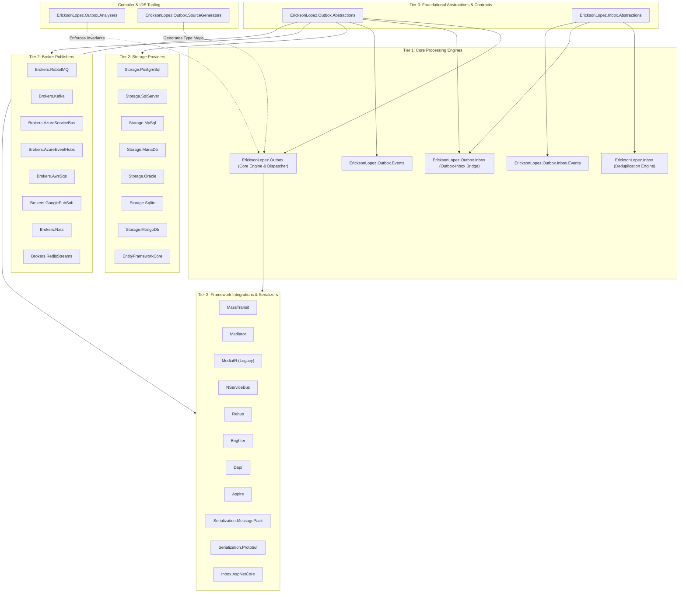
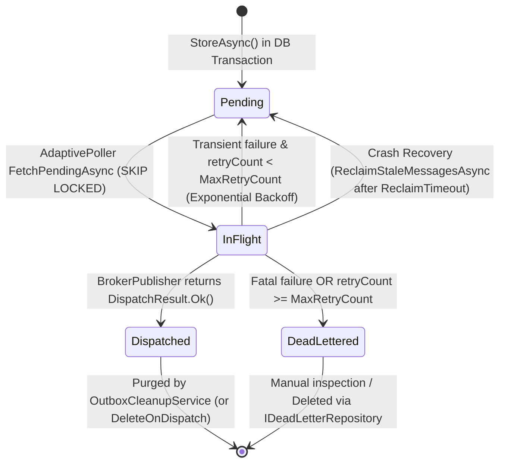
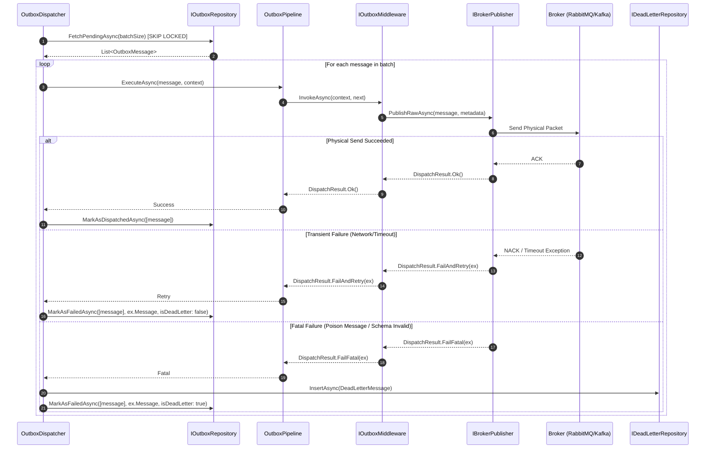

<!-- Copyright © Erickson Lopez. MIT License. -->

# EricksonLopez.Outbox Architecture Guide & Functional Map

This document describes the internal architecture, layer transitions, and execution flow of the `EricksonLopez.Outbox` and `EricksonLopez.Inbox` ecosystem.

---

## 1. Architectural Overview & System Layers

### 1.1. Clean Architecture System Layers

The ecosystem is structured into distinct, decoupled layers conforming to Clean Architecture and DDD principles:

```mermaid
flowchart TD
    subgraph ClientApp["Client Application Layer"]
        Service["Application Service / Command Handler"]
        Domain["Domain Entities & Aggregates"]
    end

    subgraph CoreAbstractions["Core Abstractions & Domain Contracts"]
        IOutbox["IOutbox / OutboxMessageBuilder"]
        IOutboxTx["IOutboxTransactionContext"]
        IOutboxSerializer["IOutboxSerializer"]
        Contracts["[OutboxMessage] / [InboxConsumer]"]
    end

    subgraph PersistenceLayer["Persistence & Storage Layer"]
        OutboxRepo["IOutboxRepository (SQL / NoSQL)"]
        DLQRepo["IDeadLetterRepository"]
        InboxRepo["IIdempotencyRepository"]
        DB[(Target Database - PostgreSQL / SQL Server / etc.)]
    end

    subgraph DispatcherLayer["Dispatcher & Processing Engine"]
        Poller["AdaptivePoller / BackgroundService"]
        Channel["Channel<OutboxMessage> (Backpressure)"]
        Pipeline["OutboxPipeline (Middlewares)"]
        RateLimiter["RateLimiter / LeakyBucket"]
    end

    subgraph TransportLayer["Transport & Broker Layer"]
        BrokerPub["IBrokerPublisher"]
        Retry["RetryPolicy / CircuitBreaker"]
        Broker[(External Broker - RabbitMQ / Kafka / Azure SB)]
    end

    subgraph ConsumerLayer["Consumer & Inbox Deduplication Layer"]
        InboxFilter["IInboxConsumerFilter / IdempotentEndpointFilter"]
        ConsumerHandler["Consumer Message Handler"]
    end

    Service -->|1. StoreAsync| IOutbox
    Domain -.->|Events| Service
    IOutbox -->|2. Serialize| IOutboxSerializer
    IOutbox -->|3. Insert in TX| OutboxRepo
    OutboxRepo -->|4. Atomic Write| DB
    
    Poller -->|5. FetchPendingAsync (SKIP LOCKED)| OutboxRepo
    Poller -->|6. Write to Channel| Channel
    Channel -->|7. Consume Parallel| Pipeline
    Pipeline -->|8. Publish via BrokerPublisher| BrokerPub
    BrokerPub -->|9. Physical Network Publish| Broker
    BrokerPub -->|10. DispatchResult| Pipeline
    Pipeline -->|11a. Success: MarkAsDispatched| OutboxRepo
    Pipeline -->|11b. Fatal: MarkAsFailed / DLQ| DLQRepo
    
    Broker -->|12. Deliver Message| ConsumerHandler
    ConsumerHandler -->|13. Intercept & Deduplicate| InboxFilter
    InboxFilter -->|14. Check / Record Processed| InboxRepo
```

### 1.2. Internal Project Dependency Graph



---

## 2. End-to-End Functional Flow & Layer Transitions

### 2.1. Layer 1: Application Entry Point & Transaction Scope
- The application executes business operations within an active database transaction (`DbTransaction`, `IDbContextTransaction`, or native driver transaction).
- The caller invokes `IOutbox.StoreAsync<T>(message, transactionContext, ct)` or uses the fluent builder `IOutbox.Publish(message)...StoreAsync(ct)`.
- **Invariants Enforced:**
  - The transaction context must be open and matching the underlying storage driver.
  - The message type must be registered via `[OutboxMessage("alias")]` or the type resolver if `ThrowOnUnregisteredType=true`.
  - The payload size must not exceed `MaxPayloadSizeInBytes` (default: 1 MB).

### 2.2. Layer 2: Serialization & Envelope Construction
- `IOutboxSerializer` (e.g., `NativeAotJsonSerializer`, `ProtobufOutboxSerializer`, `MessagePackOutboxSerializer`) serializes the payload to binary or UTF-8 bytes (`ReadOnlyMemory<byte>`).
- Structured headers (`CorrelationId`, `CausationId`, custom headers) are serialized to standard JSON.
- An `OutboxMessage` record is constructed with:
  - `Id`: Generated `Guid` (v7 / sequential recommended).
  - `MessageType`: Stable alias string (e.g., `"order.created.v1"`).
  - `Payload`: Binary byte array.
  - `CreatedAt`: `DateTimeOffset.UtcNow`.
  - `DeliverAt`: Optional delayed delivery timestamp.
  - `State`: `OutboxMessageStatus.Pending` (0).

### 2.3. Layer 3: Persistence Layer (Atomic Database Write)
- The storage implementation (`PostgreSqlOutboxRepository`, `SqlServerOutboxRepository`, `EntityFrameworkCoreOutboxRepository`, etc.) executes an `INSERT` statement within the **same** ambient transaction.
- **Unified Commit:** The caller commits the transaction. If the database commit succeeds, both domain changes and outbox messages are durable. If the commit fails, everything rolls back.

### 2.4. Layer 4: Dispatcher & Polling Engine
- The background daemon `OutboxDispatcherService` runs an `AdaptivePoller`:
  - When messages are pending, polling interval is `0ms` (maximum throughput).
  - When the queue is empty, the interval backs off to `PollingInterval` (default: 500ms).
  - External triggers can invoke `IPollerWakeup.Wakeup()` to immediately cancel delay and trigger a poll.
- **Concurrency & Multi-Instance Coordination:**
  - PostgreSQL: `SELECT ... FOR UPDATE SKIP LOCKED`
  - SQL Server: `SELECT ... WITH (UPDLOCK, READPAST, ROWLOCK)`
  - MySQL / MariaDB: `SELECT ... FOR UPDATE SKIP LOCKED`
  - Oracle: `SELECT ... FOR UPDATE SKIP LOCKED`
  - MongoDB: Optimistic document locking with atomic status transitions.
- Read messages transition to `InFlight` (1) and are fed into an internal bounded `Channel<OutboxMessage>` with capacity `ChannelCapacity` (default: 1,000) providing backpressure.

### 2.5. Layer 5: Middleware Pipeline
- Messages in the channel are consumed by worker tasks up to `MaxDegreeOfParallelism`.
- Each message traverses the `OutboxPipeline` comprising registered `IOutboxMiddleware` instances (e.g., Telemetry, Logging, Header Enrichment, Message Filtering, Circuit Breaking).
- If `HasOnlySingletonMiddlewares=true`, the compiled pipeline delegate is cached per batch, eliminating per-message runtime allocations.

### 2.6. Layer 6: Broker Publishing & Result Resolution
- The terminal step in the pipeline invokes `IBrokerPublisher.PublishRawAsync(message, metadata, context)`.
- The publisher returns a `DispatchResult`:
  - `DispatchResult.Ok()`: Successfully delivered.
  - `DispatchResult.FailAndRetry(exception, incrementRetryCount)`: Transient error; will back off and retry.
  - `DispatchResult.FailFatal(exception)`: Permanent error (e.g., payload corrupt, schema rejected); routes to DLQ immediately.

### 2.7. Layer 7: Confirmation & Dead Letter Queue (DLQ)
- Successful messages:
  - If `DeleteOnDispatch=true` (recommended default): Message is `DELETE`d from the table.
  - If `DeleteOnDispatch=false`: Status is updated to `Dispatched` (2) with `ProcessedAt = UtcNow`.
- Failed messages:
  - If `retryCount < MaxRetryCount`: Scheduled for retry with exponential backoff: `POWER(2, retry_count) * 10s`.
  - If `retryCount >= MaxRetryCount` or fatal error: Message is transferred to `IDeadLetterRepository` (`dead_letter_messages` table) with reason and error details, and removed from active queue.

### 2.8. Layer 8: Inbox Deduplication & Idempotency
- When receiving messages on the consumer side, `IInboxIdempotencyChecker` / `IInboxConsumerFilter` intercepts execution:
  - Atomically checks if `(MessageId, ConsumerId)` exists in `inbox_messages` / `idempotency_records`.
  - If duplicate: Skips handler execution and returns success.
  - If new: Records processing within the consumer's local transaction and executes domain logic.

### 2.9. Layer 9: Cleanup & Retention Daemons
- `OutboxCleanupService` runs periodically to purge dispatched messages older than retention limits.
- `InboxCleanupBackgroundService` purges expired idempotency records older than `RetentionPeriod` (default: 7 days) and `DuplicateDetectionWindow` (default: 30 days).

---

## 3. Detailed Mermaid Diagrams

### 3.1. Outbox Message Lifecycle State Diagram



### 3.2. Sequential Dispatch Pipeline Flow



---

## 4. Multi-Instance Concurrency & High Availability

In a horizontally scaled Kubernetes cluster with multiple instances running the Dispatcher background service:

```mermaid
graph TD
    subgraph KubernetesCluster["Kubernetes Deployment (3 Replicas)"]
        Pod1["Pod 1 (Dispatcher Service)"]
        Pod2["Pod 2 (Dispatcher Service)"]
        Pod3["Pod 3 (Dispatcher Service)"]
    end

    subgraph DatabaseEngine["High Availability PostgreSQL Cluster"]
        DBMaster[("Primary Database (outbox_messages table)")]
    end

    subgraph BrokerCluster["Message Broker Cluster"]
        RMQCluster["RabbitMQ / Kafka Cluster"]
    end

    Pod1 -->|SELECT FOR UPDATE SKIP LOCKED (Batch 1-100)| DBMaster
    Pod2 -->|SELECT FOR UPDATE SKIP LOCKED (Batch 101-200)| DBMaster
    Pod3 -->|SELECT FOR UPDATE SKIP LOCKED (Batch 201-300)| DBMaster

    Pod1 -->|Publish Batch 1-100| RMQCluster
    Pod2 -->|Publish Batch 101-200| RMQCluster
    Pod3 -->|Publish Batch 201-300| RMQCluster
```

- **Zero Duplicate Reading:** Row-level locks (`SKIP LOCKED`) guarantee that no two instances ever read or dispatch the same message concurrently.
- **Crash Recovery:** If Pod 2 crashes while processing messages, `ReclaimStaleMessagesAsync` will automatically release the stale `InFlight` messages back to `Pending` after `ReclaimTimeout` (default: 5 minutes).
