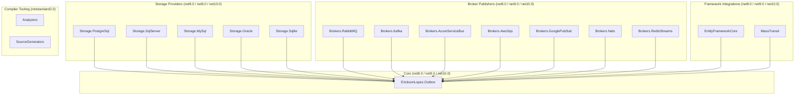
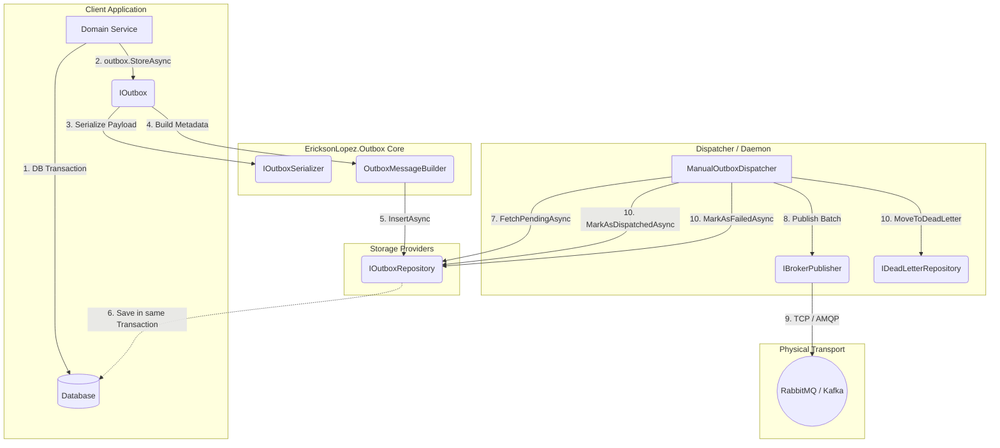
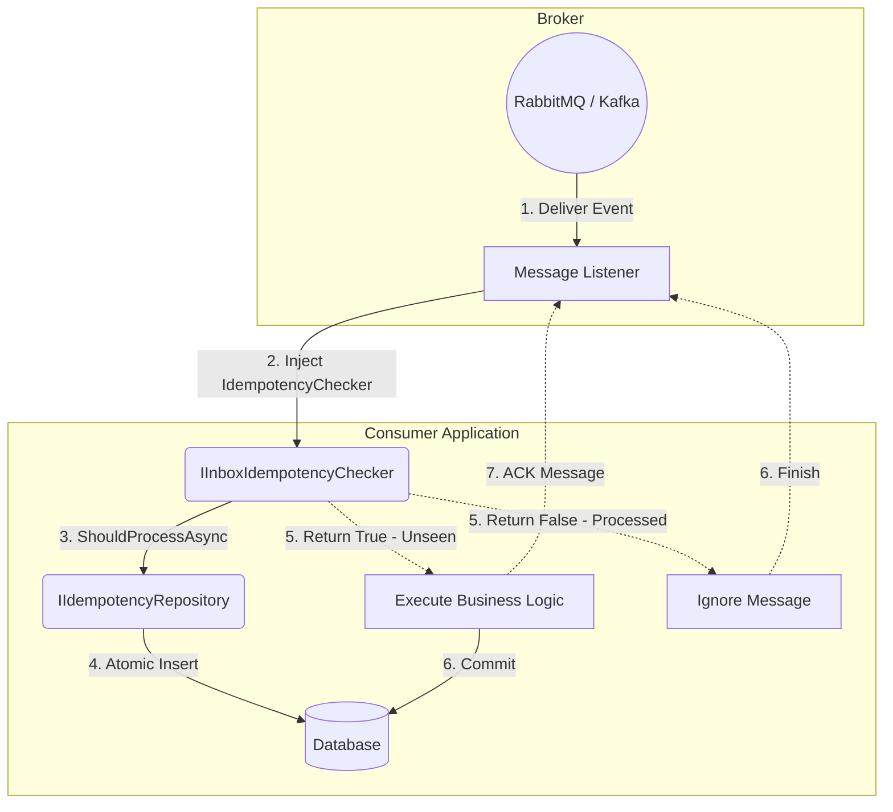

# EricksonLopez.Outbox Architecture

This document describes the internal architecture of `EricksonLopez.Outbox`, a robust implementation of the Transactional Outbox and Idempotent Consumer (Inbox) patterns for .NET applications.

## High-Level View

The ecosystem is divided into 5 major layers:

1. **Core Abstraction:** Exposes the `IOutbox`, `IOutboxTransactionContext` interfaces, the Serialization pipeline, and the internal Dispatcher.
2. **Storage Layer:** Raw ADO.NET implementations for databases (PostgreSQL, SQL Server, MySQL, Oracle, SQLite) via the `IOutboxRepository`, `IIdempotencyRepository`, and `IDeadLetterRepository` interfaces.
3. **EF Core Integration:** Entity Framework Core adapter that wraps `DbContext` transactions for outbox operations.
4. **Transport Layer (Brokers):** Implementations of `IBrokerPublisher` to send physical messages (RabbitMQ, Kafka, Azure Service Bus, AWS SQS, Google Pub/Sub, NATS, Redis Streams).
5. **Consumer Layer (Inbox):** Middleware or idempotency checker `IInboxIdempotencyChecker` that uses the `IIdempotencyRepository`.

Additionally, **compiler tooling** (Analyzers + SourceGenerators) targets `netstandard2.0` and runs at build time.

## Project Dependency Graph

## Outbox Publishing Architectural Flow

## Inbox Consumption Architectural Flow

## Architectural Patterns Used

### 1. Transactional Outbox Pattern
Ensures that the creation of business entities and the publication of their respective events (messages) happen atomically. Avoids the "Dual Write Problem" (where the DB saves the entity but the message fails to send to the Broker, or vice versa).

### 2. Idempotent Consumer (Inbox Pattern)
In distributed systems, the network and the broker only guarantee **At-Least-Once** delivery. The consumer assumes the responsibility of dealing with duplicate messages. Using `ShouldProcessAsync`, the system attempts to atomically insert the message ID. If the "Unique" constraint in the DB fails (or "ON CONFLICT DO NOTHING" skips insertion), the consumer knows it is a duplicate and ACKs the broker without re-executing.

### 3. Exponential Backoff & Circuit Breaker
The Dispatcher has internal resilience when attempting to send messages to the Broker. If it fails, it retries using an `ExponentialBackoffPolicy`. If the Broker is completely down, the `CircuitBreaker` temporarily pauses the Dispatcher to avoid saturating the database with useless retries.

### 4. Adaptive Polling
The `AdaptivePoller` dynamically adjusts polling intervals based on message throughput. When the outbox is empty, polling frequency decreases to minimize database load. When messages are detected, the poller ramps up to near-real-time dispatch.

### 5. Zero Allocations & Native AOT
The intensive use of `ValueTask`, `ReadOnlyMemory<T>`, `ArrayPool<T>`, and `System.Text.Json` source generators (`NativeAotJsonSerializer`) ensures that the Outbox generates minimal pressure on the Garbage Collector, optimizing its performance in serverless or edge computing architectures.
