<!-- Copyright © Erickson Lopez. MIT License. -->

# CI/CD Pipelines & Quality Gates

The `EricksonLopez.Outbox` ecosystem uses a comprehensive suite of 10 specialized GitHub Actions workflows. The architecture decouples continuous integration from mutation testing, performance benchmarking, compliance verification, and automated package publishing — ensuring fast feedback loops on PRs while enforcing strict enterprise quality gates.

---

## 1. Workflow Catalog

| Workflow Name | Workflow File | Trigger | Primary Purpose |
|---|---|---|---|
| **Main CI Orchestrator** | `ci.yml` | `push`, `pull_request` (`main`, `develop`) | Fast PR orchestrator: calls build-test and NativeAOT smoke test |
| **Reusable Build & Test** | `dotnet-build-test.yml` | `workflow_call` | Restores, builds, runs tests, collects coverage, executes SonarCloud |
| **NativeAOT Smoke Test** | `aot-smoke-test.yml` | `push`/`PR` (`main`, `develop`), `workflow_call`, `workflow_dispatch` | Validates NativeAOT compilation (`PublishAot=true`) and runs binary |
| **Benchmark Regression Gate** | `benchmark-regression-gate.yml` | `pull_request` (`main`, `develop` touching `src/**` or `benchmarks/**`), `workflow_dispatch` | Enforces zero heap allocations (0 B) and <5% latency delta vs baseline |
| **Baseline Benchmarks** | `benchmarks.yml` | `push v*` tag, `workflow_dispatch` | Captures and persists BenchmarkDotNet baseline on release tags |
| **Weekly Deep Benchmarks** | `weekly-benchmarks.yml` | Schedule Sun 02:00 UTC, `workflow_dispatch` | Multi-runtime benchmark matrix across .NET 8, 9, and 10 |
| **Repo Compliance Gate** | `repo-compliance.yml` | `push`, `pull_request` (`main`), `workflow_dispatch` | Verifies architecture invariants, ADR registry, and naming conventions |
| **Mutation Testing Matrix** | `mutation-testing.yml` | Schedule Mon 04:00 UTC, `workflow_dispatch` | Runs Stryker.NET across 34 parallel package jobs (score ≥95%) |
| **Release Please** | `release-please.yml` | `push` → `main` | Generates Conventional Commit release PRs and tags `v*.*.*` |
| **Publish Packages** | `publish.yml` | `push v*.*.*` tag, `workflow_dispatch` | Validates gates, packs 36 packages, signs, attests, and pushes to NuGet |

---

## 2. End-to-End Pipeline Architecture

```mermaid
flowchart TD
    subgraph PullRequest["Pull Request & Merge to main/develop"]
        PR[Developer opens PR / pushes code]
        PR --> CI[ci.yml Orchestrator]
        PR --> BRG[benchmark-regression-gate.yml]
        PR --> RCG[repo-compliance.yml]

        subgraph CIOrchestration["ci.yml"]
            CI --> DBT[dotnet-build-test.yml]
            CI --> AOT[aot-smoke-test.yml]
        end

        subgraph BuildTest["dotnet-build-test.yml"]
            DBT --> SNK1[Restore SNK Key]
            SNK1 --> RESTORE1[dotnet restore]
            RESTORE1 --> SONAR1[SonarScanner Begin]
            SONAR1 --> BUILD1[dotnet build Release]
            BUILD1 --> TEST1[dotnet test + Coverlet]
            TEST1 --> SONAR2[SonarScanner End]
            SONAR2 --> CODECOV1[Upload to Codecov]
        end

        subgraph AOTSmoke["aot-smoke-test.yml"]
            AOT --> CLANG[Install clang & lld]
            CLANG --> PUB_AOT[dotnet publish --PublishAot=true]
            PUB_AOT --> RUN_AOT[Execute AOT Binary]
        end

        subgraph BenchGate["benchmark-regression-gate.yml"]
            BRG --> BENCH_RUN[Run BenchmarkDotNet on net10.0]
            BENCH_RUN --> EVAL_GATE[verify-benchmark-gate.ps1]
            EVAL_GATE --> HEAP_CHK{Allocations == 0 B?}
            EVAL_GATE --> LAT_CHK{Regression <= 5%?}
        end

        subgraph CompGate["repo-compliance.yml"]
            RCG --> SCRIPT_NODE[node scripts/verify-compliance.js]
            SCRIPT_NODE --> SCRIPT_PWSH[pwsh scripts/verify-compliance.ps1]
            SCRIPT_PWSH --> DIAG_BUILD[dotnet build with TreatWarningsAsErrors]
        end
    end

    subgraph ReleaseFlow["Automated Release & Publishing"]
        PR_MERGE[PR merged to main] --> RP[release-please.yml]
        RP --> RP_PR{Release PR exists?}
        RP_PR -- No --> RP_CREATE[Open / Update Release PR]
        RP_PR -- Merged --> RP_TAG[Create GitHub Release + tag vX.Y.Z]
        RP_TAG --> PUB[publish.yml]

        subgraph PublishPipeline["publish.yml"]
            PUB --> VER[Resolve Version]
            VER --> MUT_CHK[Verify Stryker Mutation Gate]
            MUT_CHK --> SNK2[Restore SNK Key]
            SNK2 --> PACK[dotnet pack -c Release — 36 packages]
            PACK --> ATTEST[Sigstore Provenance Attestation]
            ATTEST --> OIDC[NuGet OIDC Login]
            OIDC --> PUSH[dotnet nuget push --skip-duplicate]
            PUSH --> GH_REL[Publish GitHub Release Notes]
        end
    end
```



---

## 3. Workflow Details & Configurations

### 3.1 Main CI Orchestrator (`ci.yml`)
- **Trigger**: Pushes and PRs targeting `main` or `develop`.
- **Function**: Lightweight caller delegating to `dotnet-build-test.yml` and `aot-smoke-test.yml`.
- **Forwarded Secrets**: `SNK_KEY`, `CODECOV_TOKEN`, `SONAR_TOKEN`.

### 3.2 Reusable Build & Test (`dotnet-build-test.yml`)
- **Execution Matrix**: Ubuntu Latest with .NET SDK 10.0.x (and multi-targeting fallback down to .NET 8.0.x).
- **Service Containers**:
  - PostgreSQL 16 Alpine (`postgres:16-alpine`, port 5432)
  - RabbitMQ 3 Management Alpine (`rabbitmq:3-management-alpine`, port 5672)
- **Quality Analysis**:
  - SonarCloud scanner running with pull request decoration and Quality Gate enforcement.
  - Coverlet code coverage collecting OpenCover and Cobertura formats.
  - Automatic coverage upload via `codecov/codecov-action@v5`.

### 3.3 NativeAOT Smoke Test (`aot-smoke-test.yml`)
- **Target Project**: `tests/EricksonLopez.Outbox.AotSmokeTest/EricksonLopez.Outbox.AotSmokeTest.csproj`
- **Compiler Flags**:
  ```ini
  -p:PublishAot=true
  -p:TreatWarningsAsErrors=true
  -p:WarningLevel=5
  DOTNET_EnableAotCompilationWarningsAsErrors=true
  ```
- **Invariant**: Verifies that publishing with NativeAOT emits 0 trim/AOT warnings (`IL2026`, `IL3050`) and that the resulting native ELF executable runs and exits with code 0.

### 3.4 Benchmark Regression Gate (`benchmark-regression-gate.yml`)
- **Trigger**: PRs targeting `main` or `develop` touching `src/**` or `benchmarks/**`.
- **Execution**: Runs BenchmarkDotNet with memory diagnostics against `EricksonLopez.Outbox.Benchmarks`.
- **Evaluator**: `scripts/verify-benchmark-gate.ps1`.
- **Invariants (ADR-038)**:
  - **Zero Allocations**: Hot-path combinators must allocate strictly `0 B`.
  - **Latency Regression**: Mean latency regression must not exceed `5%` vs `benchmarks/results/baseline.json`.

### 3.5 Repository Compliance & Quality Gate (`repo-compliance.yml`)
- **Trigger**: Pushes and PRs targeting `main`.
- **Checks**:
  - Executes `scripts/verify-compliance.js` (enforces single H1 per document, kebab-case in `docs/`, SCREAMING_CASE in root, ADR table synchronization, MIT license headers).
  - Executes `scripts/verify-compliance.ps1`.
  - Builds entire solution with `TreatWarningsAsErrors=true`.
  - Runs all non-integration unit tests.

### 3.6 Scheduled Mutation Testing (`mutation-testing.yml`)
- **Schedule**: Weekly on Monday at 04:00 UTC (and manual dispatch).
- **Parallel Matrix**: 34 separate jobs running Stryker.NET with dedicated configuration files (`stryker-*.json`).
- **Thresholds**:
  - `break=95%`: Build fails if mutation score drops below 95%.
  - `high=100%`: Green target.
- **Reporting**: Aggregates individual results and posts GitHub Commit Status `mutation-testing/stryker`.

### 3.7 Release Automation (`release-please.yml`)
- **Trigger**: Pushes to `main`.
- **Mechanism**: Analyzes commit messages following Conventional Commits (`feat:`, `fix:`, `feat!:`) to automatically maintain release pull requests and bump versions.
- **Release Action**: When the release PR is merged, Release Please tags the repository (`vX.Y.Z`), creates a GitHub Release, and invokes `publish.yml`.

### 3.8 Package Publishing (`publish.yml`)
- **Trigger**: Push of `v*.*.*` git tag, or manual workflow dispatch.
- **Pre-Publish Gates**:
  1. Validates mutation testing score threshold via `scripts/verify-mutation-gate.js`.
  2. Runs test suite with `--configuration Release`.
  3. Uploads verification coverage report to Codecov (`publish-gate` flag).
- **Packaging**: Packs all 36 packable projects in Release mode with Strong Name signing.
- **Supply Chain Attestation**: Invokes `actions/attest-build-provenance@v2` generating SLSA / Sigstore cryptographic build provenance.
- **Publishing**: Uses GitHub OIDC trusted publishing with `NuGet/login@v1` and pushes packages to NuGet.org with `--skip-duplicate`.

---

## 4. Secrets Configuration Matrix

The following secrets are referenced across workflows:

| Secret Name | Referenced Workflows | Purpose |
|---|---|---|
| `SNK_KEY` | `ci.yml`, `dotnet-build-test.yml`, `aot-smoke-test.yml`, `benchmark-regression-gate.yml`, `benchmarks.yml`, `weekly-benchmarks.yml`, `publish.yml` | Base64-encoded Strong Name Key (`EricksonLopez.snk`) for signing assemblies |
| `CODECOV_TOKEN` | `ci.yml`, `dotnet-build-test.yml`, `publish.yml` | Token for uploading test coverage reports to Codecov |
| `SONAR_TOKEN` | `ci.yml`, `dotnet-build-test.yml` | Token for authenticating SonarCloud static analysis scanner |
| `GITHUB_TOKEN` | `dotnet-build-test.yml`, `release-please.yml`, `mutation-testing.yml` | Built-in GitHub token for PR decoration, commit status posting, and release management |

> [!NOTE]
> No static `NUGET_API_KEY` is required. The repository uses **GitHub OIDC Trusted Publishing** (`NuGet/login@v1`), eliminating long-lived API tokens.

---

## 5. Branch Strategy

Based on CI trigger definitions:

| Branch Pattern | Protection Level | CI Executions |
|---|---|---|
| `main` | Production Protected | `ci.yml`, `repo-compliance.yml`, `release-please.yml` |
| `develop` | Integration Protected | `ci.yml`, `benchmark-regression-gate.yml` |

The repository adheres to **trunk-based development**. Features and bug fixes merge into `develop` or `main` via reviewed pull requests. Release Please automates changelog generation and version tagging directly on `main`.

---

## 6. Supply Chain Security Invariants

1. **Deterministic SDK Pinning**: All builds enforce .NET SDK 10.0.100 via `global.json` (`rollForward: latestFeature`).
2. **Central Package Management (CPM)**: All NuGet dependency versions are centrally locked in `Directory.Packages.props`. Transitive dependencies are audited.
3. **NuGet Audit**: Enabled in `Directory.Build.props`:
   ```xml
   <NuGetAudit>true</NuGetAudit>
   <NuGetAuditMode>all</NuGetAuditMode>
   <NuGetAuditLevel>low</NuGetAuditLevel>
   ```
4. **Cryptographic Signing**: All published assemblies are strongly named using RSA key pairs (`EricksonLopez.snk`).
5. **Sigstore Attestation**: Build provenance is attested via `actions/attest-build-provenance@v2` for every published `.nupkg`.
6. **Keyless Publishing**: OIDC token exchange with NuGet.org replaces static credential storage.
