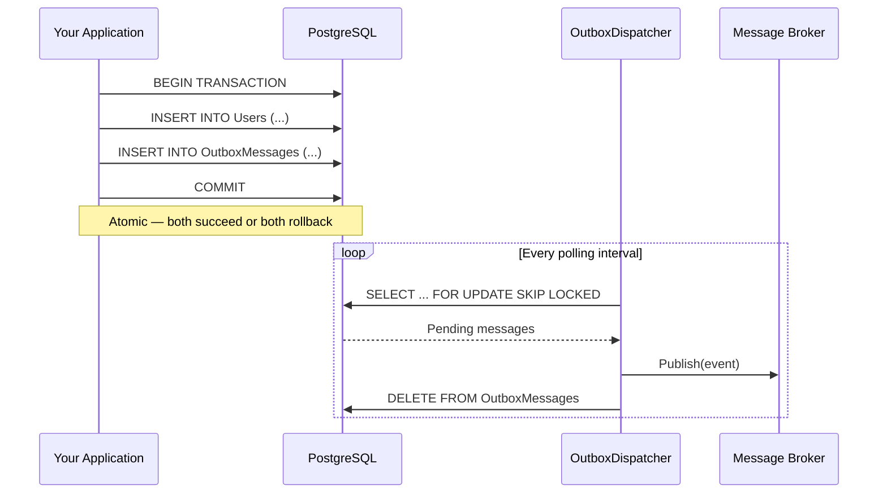

# Level 1: Getting Started

In this level you will install `EricksonLopez.Outbox`, configure it with Entity Framework Core and PostgreSQL, and publish your first guaranteed event.

## 1. Installation (NuGet)

Add the following packages to your project:

```bash
# Core library (IOutbox, Dispatcher, Serialization)
dotnet add package EricksonLopez.Outbox

# Entity Framework Core integration (DbContext-based repositories)
dotnet add package EricksonLopez.Outbox.EntityFrameworkCore

# Source Generators (compile-time type mapping for AOT)
dotnet add package EricksonLopez.Outbox.SourceGenerators
```

> [!TIP]
> If you prefer raw ADO.NET over Entity Framework Core, install a Storage package
> instead (e.g., `EricksonLopez.Outbox.Storage.PostgreSql`). See [Level 2](level-02-configuration.md)
> for raw ADO.NET setup.

## 2. Define Your First Event

Messages stored in the outbox are plain C# types. We recommend using `record` types for immutability:

```csharp
using EricksonLopez.Outbox;

[OutboxMessage("user-registered")]
public record UserRegisteredEvent(Guid UserId, string Email);
```

The `[OutboxMessage]` attribute registers this type with the source generator for AOT-compatible type resolution. The string argument is the message **alias** — a stable identifier used in the database.

## 3. Configure EF Core DbContext

Apply the Outbox entity configurations to your `DbContext`:

```csharp
using Microsoft.EntityFrameworkCore;
using EricksonLopez.Outbox.EntityFrameworkCore;

public class AppDbContext : DbContext
{
    public AppDbContext(DbContextOptions<AppDbContext> options) : base(options) { }

    protected override void OnModelCreating(ModelBuilder modelBuilder)
    {
        base.OnModelCreating(modelBuilder);
        
        // Adds OutboxMessages, DeadLetters, and IdempotencyRecords tables
        modelBuilder.ApplyOutboxEntityConfigurations();
    }
}
```

Then generate and apply a migration:
```bash
dotnet ef migrations add AddOutboxTables
dotnet ef database update
```

## 4. Register Services (Dependency Injection)

In your `Program.cs`, register the Outbox services:

```csharp
using EricksonLopez.Outbox.Hosting;
using EricksonLopez.Outbox.EntityFrameworkCore;

var builder = WebApplication.CreateBuilder(args);

// 1. Register your DbContext
builder.Services.AddDbContext<AppDbContext>(options =>
    options.UseNpgsql(builder.Configuration.GetConnectionString("DefaultConnection")));

// 2. Register Outbox core services
builder.Services.AddOutbox(options =>
{
    options.UseSerializer(new NativeAotJsonSerializer(MyJsonContext.Default));
    options.UseGeneratedTypes();
    // Register a broker publisher — required for the dispatcher to publish messages:
    options.UseBroker(sp => new ConsoleBrokerPublisher()); // Swap for RabbitMQ, Kafka, etc.
});

// 3. Register EF Core-backed repositories (also registers IOutbox = DefaultOutbox)
builder.Services.AddOutboxEntityFrameworkCore<AppDbContext>();

// 4. Start the background Dispatcher
builder.Services.AddOutboxDispatcher(options =>
{
    options.BatchSize = 100;  // Default: 100 messages per polling cycle
});
```

> [!NOTE]
> `AddOutbox()` registers the core producer API (`IOutbox`).  
> `AddOutboxDispatcher()` registers the background `OutboxDispatcherBackgroundService`.  
> These are idempotent — calling both is safe and recommended.

## 5. Store Your First Event

Inject `IOutbox` into your service and store an event within a transaction:

```csharp
using EricksonLopez.Outbox;
using EricksonLopez.Outbox.Persistence;

public class UserService
{
    private readonly AppDbContext _dbContext;
    private readonly IOutbox _outbox;

    public UserService(AppDbContext dbContext, IOutbox outbox)
    {
        _dbContext = dbContext;
        _outbox = outbox;
    }

    public async Task RegisterUserAsync(string email, CancellationToken ct)
    {
        // 1. Begin a local database transaction
        await using var transaction = await _dbContext.Database.BeginTransactionAsync(ct);
        var txContext = new DbTransactionContext(transaction.GetDbTransaction());

        // 2. Create and save the domain entity
        var userId = Guid.NewGuid();
        var user = new User { Id = userId, Email = email };
        _dbContext.Users.Add(user);

        // 3. Store the event in the Outbox (same transaction)
        var integrationEvent = new UserRegisteredEvent(userId, email);
        await _outbox.StoreAsync(integrationEvent, txContext, ct);

        // 4. Commit atomically — both user and event are persisted or neither is
        await _dbContext.SaveChangesAsync(ct);
        await transaction.CommitAsync(ct);
    }
}
```

## What Happens at Runtime?



---

**Next:** In [Level 2](level-02-configuration.md), you will explore advanced configuration options, retry policies, and raw ADO.NET setup.
