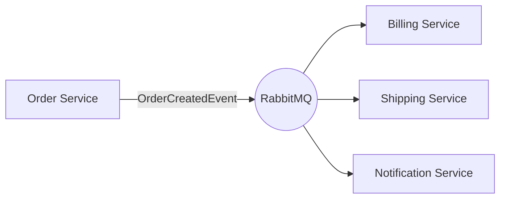

# Level 3: Real-World Use Cases

This level demonstrates practical integration patterns for `EricksonLopez.Outbox` in common microservice scenarios.

## 1. E-Commerce: Order → Billing → Shipping

The classic microservices choreography pattern:



### Order Service (Producer)

```csharp
using EricksonLopez.Outbox;
using EricksonLopez.Outbox.Contracts;
using EricksonLopez.Outbox.Persistence;

[OutboxMessage("order-created-v1")]
public record OrderCreatedEvent(Guid OrderId, string CustomerId, decimal Total);

public class OrderService
{
    private readonly AppDbContext _db;
    private readonly IOutbox _outbox;

    public OrderService(AppDbContext db, IOutbox outbox) => (_db, _outbox) = (db, outbox);

    public async Task PlaceOrderAsync(CreateOrderCommand cmd, CancellationToken ct)
    {
        await using var tx = await _db.Database.BeginTransactionAsync(ct);

        // DbTransactionContext wraps the ADO.NET DbTransaction for the outbox.
        // Alternatively: tx.GetDbTransaction().ToOutboxContext()
        var txContext = new DbTransactionContext(tx.GetDbTransaction());

        var order = new Order
        {
            Id = Guid.NewGuid(),
            CustomerId = cmd.CustomerId,
            Total = cmd.Total,
            Status = OrderStatus.Placed
        };
        _db.Orders.Add(order);

        await _outbox.StoreAsync(
            new OrderCreatedEvent(order.Id, order.CustomerId, order.Total),
            txContext,
            ct);

        await _db.SaveChangesAsync(ct);
        await tx.CommitAsync(ct);
    }
}
```

### Billing Service (Idempotent Consumer)

The `IInboxIdempotencyChecker` interface prevents duplicate processing. The key method is `ShouldProcessAsync`, which requires a **unique `consumerId`** per consumer:

```csharp
using EricksonLopez.Outbox.Idempotency;
using EricksonLopez.Outbox.Persistence;

public class BillingConsumer
{
    private readonly IInboxIdempotencyChecker _inbox;
    private readonly BillingDbContext _db;

    // A stable, unique ID for THIS consumer.
    // Never reuse OutboxConstants.DispatcherConsumerId ("outbox-dispatcher").
    private const string ConsumerId = "billing-service.order-created-handler";

    public BillingConsumer(IInboxIdempotencyChecker inbox, BillingDbContext db)
        => (_inbox, _db) = (inbox, db);

    public async Task HandleAsync(
        OrderCreatedEvent evt,
        string messageId,
        IOutboxTransactionContext transaction,
        CancellationToken ct)
    {
        // Idempotency check — atomically inserts a record.
        // Returns false if this (messageId, consumerId) pair was already processed.
        if (!await _inbox.ShouldProcessAsync(messageId, ConsumerId, transaction, ct))
            return; // Duplicate — skip silently

        // Business logic (executes at most once per unique messageId + consumerId combination)
        var invoice = new Invoice { OrderId = evt.OrderId, Amount = evt.Total };
        _db.Invoices.Add(invoice);
        await _db.SaveChangesAsync(ct);
    }
}
```

> [!IMPORTANT]
> Always provide an **explicit, stable `consumerId`** (e.g., `"billing-service.order-created-handler"`). This ensures idempotency records are isolated per consumer. Reusing `OutboxConstants.DispatcherConsumerId` will cause collisions with the dispatcher's internal deduplication.

---

## 2. Batch Processing: Bulk Event Publishing

### `ReadOnlyMemory<T>` Overload (Zero-Copy)

Store multiple events in a single transaction using the `ReadOnlyMemory<T>` batch overload:

```csharp
public async Task ImportProductsAsync(IReadOnlyList<Product> products, CancellationToken ct)
{
    await using var tx = await _db.Database.BeginTransactionAsync(ct);
    var txContext = new DbTransactionContext(tx.GetDbTransaction());

    _db.Products.AddRange(products);

    // Build the events array
    var events = products
        .Select(p => new ProductImportedEvent(p.Id, p.Name))
        .ToArray();

    // Batch store via ReadOnlyMemory<T> — uses bulk INSERT in a single round-trip
    await _outbox.StoreAsync(
        new ReadOnlyMemory<ProductImportedEvent>(events),
        txContext,
        ct);

    await _db.SaveChangesAsync(ct);
    await tx.CommitAsync(ct);
}
```

### `IEnumerable<T>` Extension Overload (Convenience)

When you already have an `IEnumerable<T>` and don't want to pre-allocate an array:

```csharp
using EricksonLopez.Outbox; // OutboxExtensions.StoreAsync is an extension method here

public async Task NotifyUsersAsync(IEnumerable<User> users, CancellationToken ct)
{
    await using var tx = await _db.Database.BeginTransactionAsync(ct);
    var txContext = tx.GetDbTransaction().ToOutboxContext(); // Extension method shorthand

    // StoreAsync(IEnumerable<T>, ...) internally converts to ReadOnlyMemory<T>
    await _outbox.StoreAsync(
        users.Select(u => new UserActivatedEvent(u.Id, u.Email)),
        txContext,
        ct);

    await _db.SaveChangesAsync(ct);
    await tx.CommitAsync(ct);
}
```

> [!TIP]
> `tx.GetDbTransaction().ToOutboxContext()` is a convenience extension method from `OutboxTransactionContextExtensions`. It's equivalent to `new DbTransactionContext(tx.GetDbTransaction())` but more fluent.

---

## 3. Fluent Builder: Rich Messages with Metadata

Use the `Publish()` fluent API to add metadata, headers, and delayed delivery:

```csharp
await _outbox
    .Publish(new OrderShippedEvent(orderId))
    .WithTransaction(txContext)
    .WithCorrelationId(correlationId)       // Tracing correlation across services
    .WithCausationId(causationId)           // Links to the triggering event/command
    .WithHeader("x-tenant-id", tenantId)   // Custom metadata propagated to the broker
    .WithDelay(TimeSpan.FromMinutes(30))    // Delayed delivery (30 minutes from now)
    .StoreAsync(ct);
```

> [!NOTE]
> `OutboxMessageBuilder<T>` auto-disposes the internal pooled headers array when `StoreAsync()` completes. You do **not** need a `using` statement. The builder implements `IDisposable` as a safety net only for the rare case where `StoreAsync()` is never called.

### `OutboxMessageBuilder<T>` Fluent API

| Method | Description |
|---|---|
| `WithTransaction(IOutboxTransactionContext)` | **Required.** Associates the database transaction. |
| `WithDelay(TimeSpan)` | Schedules the message to become visible after a delay. |
| `WithDeliverAt(DateTimeOffset)` | Schedules the message to become visible at an absolute timestamp. |
| `WithHeader(string key, string value)` | Adds a custom metadata header. Can be called multiple times. |
| `WithCorrelationId(string)` | Sets the W3C correlation ID for distributed tracing. |
| `WithCausationId(string)` | Sets the causation ID linking this message to its trigger. |
| `StoreAsync(CancellationToken)` | Persists the message. Auto-disposes builder resources. |

---

## 4. Multi-Broker Routing

Route different event types to different brokers using the `Route(alias).ToPublisher(...)` API:

```csharp
builder.Services.AddOutbox(options =>
{
    // Default: RabbitMQ for most events (any alias not explicitly routed)
    options.UseBroker(sp => new RabbitMQBrokerPublisher(sp.GetRequiredService<IConnection>()));

    // Route "analytics-event-v1" events exclusively to Kafka
    options.Route("analytics-event-v1")
           .ToPublisher(sp => new KafkaBrokerPublisher(sp.GetRequiredService<IProducer<string, byte[]>>()));

    // Route "notification-sent-v1" events exclusively to AWS SQS
    options.Route("notification-sent-v1")
           .ToPublisher(sp => new AwsSqsBrokerPublisher(sp.GetRequiredService<IAmazonSQS>(), queueUrl));
});
```

The `IBrokerSelector` (internal) receives every message's type alias and dispatches it to the matching `IBrokerPublisher`. If no route matches, the default publisher is used.

---

## 5. Domain Events in DDD

Collect domain events within your aggregate root and flush them to the outbox atomically via a Unit of Work:

```csharp
public abstract class AggregateRoot
{
    private readonly List<object> _domainEvents = [];
    public IReadOnlyList<object> DomainEvents => _domainEvents;
    protected void AddDomainEvent(object evt) => _domainEvents.Add(evt);
    public void ClearDomainEvents() => _domainEvents.Clear();
}

// In your Unit of Work / SaveChanges override:
public async Task CommitAsync(CancellationToken ct)
{
    await using var tx = await _db.Database.BeginTransactionAsync(ct);
    var txContext = tx.GetDbTransaction().ToOutboxContext();

    // Collect all domain events from tracked aggregates
    var aggregates = _db.ChangeTracker.Entries<AggregateRoot>()
        .Where(e => e.Entity.DomainEvents.Count > 0)
        .Select(e => e.Entity)
        .ToList();

    foreach (var aggregate in aggregates)
    {
        // Use IEnumerable<object> extension — type resolver handles each type alias
        await _outbox.StoreAsync(aggregate.DomainEvents, txContext, ct);
        aggregate.ClearDomainEvents();
    }

    await _db.SaveChangesAsync(ct);
    await tx.CommitAsync(ct);
}
```

> [!TIP]
> Each domain event type in the collection must be decorated with `[OutboxMessage("alias")]` and registered in the type resolver. When `ThrowOnUnregisteredType = false` (the default), unregistered types are silently skipped.

---

**Next:** In [Level 4](level-04-domain-events.md), you will dive deeper into domain event patterns and integration event design.
