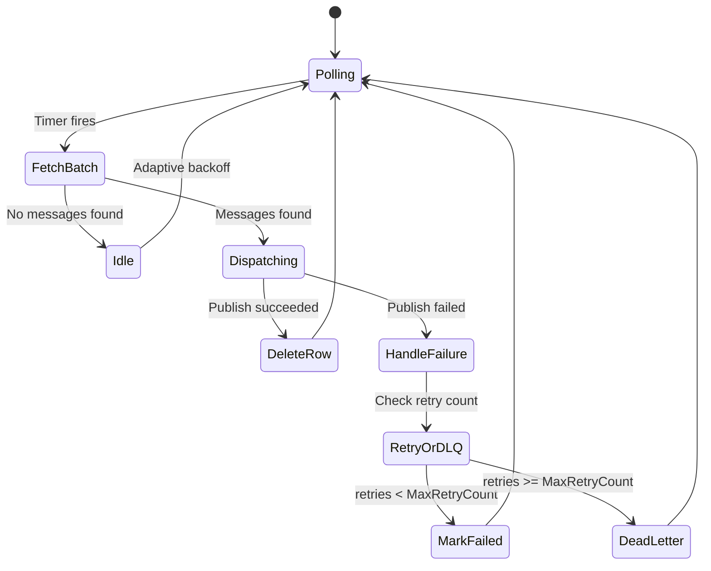
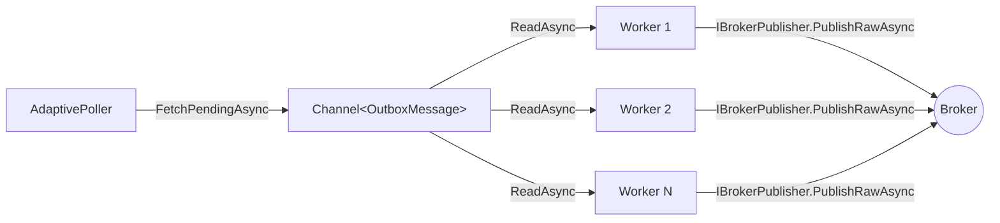
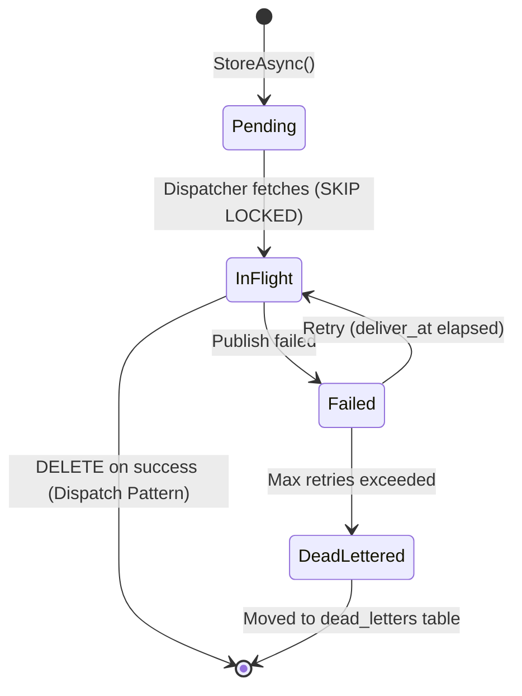

<!-- Copyright © Erickson Lopez. MIT License. -->

# Level 5: Processing and Dispatching

How does `EricksonLopez.Outbox` know when new messages are available, and how does it deliver them without exhausting your server's resources? This level explores the internals of the `OutboxDispatcherBackgroundService`.

## 1. The Background Service

When you call `AddOutboxDispatcher()`, the library registers an `IHostedService` — specifically an `OutboxDispatcherBackgroundService`. This service starts with your application and runs on a background thread for the lifetime of the process.



---

## 2. Adaptive Polling (`AdaptivePoller`)

The `AdaptivePoller` dynamically adjusts the polling frequency based on message throughput:

| Scenario | Behavior |
|---|---|
| **Messages found** | Poll again immediately (near-real-time dispatch) |
| **No messages** | Gradually increase the interval (exponential backoff) |
| **Sustained idle** | Settle at the maximum interval (`PollingInterval`, default 500ms) |
| **New messages arrive** | Snap back to minimum interval instantly |

This approach prevents:
- **Database saturation** — idle polling doesn't spam the database with empty queries
- **Latency spikes** — when messages arrive, the poller ramps up immediately

### Waking Up the Poller Externally (`IPollerWakeup`)

If you produce a message and want it dispatched **immediately** without waiting for the next polling cycle, inject `IPollerWakeup` and call `WakeAsync()`:

```csharp
using EricksonLopez.Outbox.Dispatcher;

public class OrderService
{
    private readonly AppDbContext _db;
    private readonly IOutbox _outbox;
    private readonly IPollerWakeup _pollerWakeup; // Registered by AddOutboxDispatcher()

    public OrderService(AppDbContext db, IOutbox outbox, IPollerWakeup pollerWakeup)
        => (_db, _outbox, _pollerWakeup) = (db, outbox, pollerWakeup);

    public async Task PlaceOrderAsync(CreateOrderCommand cmd, CancellationToken ct)
    {
        await using var tx = await _db.Database.BeginTransactionAsync(ct);
        var txContext = new DbTransactionContext(tx.GetDbTransaction());

        _db.Orders.Add(new Order { Id = Guid.NewGuid(), CustomerId = cmd.CustomerId });
        await _outbox.StoreAsync(new OrderCreatedEvent(cmd.CustomerId), txContext, ct);
        await _db.SaveChangesAsync(ct);
        await tx.CommitAsync(ct);

        // Signal the poller to wake up now rather than waiting for the next interval.
        // This is optional but reduces perceived latency from ~500ms → ~0ms.
        await _pollerWakeup.WakeAsync(ct);
    }
}
```

> [!NOTE]
> `IPollerWakeup.WakeAsync()` is a fire-and-forget signal — it never blocks. If the dispatcher is already polling, the signal is silently ignored.

---

## 3. Concurrent Dispatch Pipeline

The dispatcher uses a `Channel<T>` (bounded channel) to decouple fetching from publishing:



`MaxDegreeOfParallelism` controls the number of concurrent workers reading from the channel. For strict ordering guarantees, set it to `1`.

---

## 4. Database Locking Strategy

The dispatcher uses database-native row locking to safely handle multiple concurrent dispatcher instances:

| Database | Lock Strategy | SQL |
|---|---|---|
| **PostgreSQL** | `SKIP LOCKED` | `SELECT ... FOR UPDATE SKIP LOCKED` |
| **SQL Server** | `READPAST` + `UPDLOCK` | `SELECT ... WITH (UPDLOCK, READPAST)` |
| **MySQL 8.0+** | `SKIP LOCKED` | `SELECT ... FOR UPDATE SKIP LOCKED` |
| **Oracle 12c+** | `SKIP LOCKED` | `SELECT ... FOR UPDATE SKIP LOCKED` |
| **SQLite** | WAL-mode table lock | No row-level locking (single dispatcher only) |

This means you can run **multiple instances** of your application (horizontal scaling) and each dispatcher instance will process a non-overlapping set of messages — no duplicates, no coordination layer needed.

---

## 5. Message Lifecycle

Every outbox message passes through a well-defined state machine:



| State | Value | Description |
|---|---|---|
| `Pending` | `0` | Stored by `StoreAsync()`, awaiting dispatch. |
| `InFlight` | `1` | Claimed by a dispatcher instance for publishing. |
| `Dispatched` | `2` | **Only written when `DeleteOnDispatch = false`** (soft-delete/audit mode). When enabled, dispatched messages are updated to state `2` and the `processed_at` column is populated. Under the default `DeleteOnDispatch = true` config, state `2` is **never written** — rows are physically deleted instead. |
| `Failed` | `3` | Publish failed — will be retried when `deliver_at` elapses. |
| `DeadLettered` | `4` | Max retries exceeded — moved to `outbox.dead_letters` table. |

> [!IMPORTANT]
> **Delete-on-Dispatch (default behavior):** When a publish succeeds, the row is **permanently deleted** from the `outbox.messages` table. This is the recommended pattern — it keeps the active table small and avoids index bloat in high-throughput scenarios.
>
> **Soft-Delete / Audit Mode (`DeleteOnDispatch = false`):** The `Dispatched` state IS written to the database. You must implement a periodic cleanup job (e.g., `DELETE FROM outbox.messages WHERE state = 2 AND processed_at < NOW() - INTERVAL '7 days'`) to prevent unbounded table growth.

### `OutboxMessageStatus` Enum

```csharp
using EricksonLopez.Outbox;

// Use OutboxMessageStatus in custom repositories or diagnostics:
var pendingMessages = messages.Where(m => m.Status == OutboxMessageStatus.Pending);
var failedMessages = messages.Where(m => m.Status == OutboxMessageStatus.Failed);
```

---

## 6. Stale Message Reclamation

If a dispatcher crashes while a message is `InFlight`, the message could be stuck forever. The **ReclaimStaleMessages** background job periodically detects messages that have been in `InFlight` state for longer than `ReclaimTimeout` (default: 5 minutes) and resets them to `Pending`.

```csharp
builder.Services.AddOutboxDispatcher(options =>
{
    options.ReclaimTimeout = TimeSpan.FromMinutes(5);   // Default: 5 minutes
    options.ReclaimInterval = TimeSpan.FromMinutes(1);  // How often to run (default: 1 minute)
    options.ReclaimBatchLimit = 1000;                   // Max messages per reclaim cycle (default: 1000)
});
```

> [!TIP]
> Set `ReclaimTimeout` to at least 2× the maximum expected publish duration (including retries). Too low a value can cause unnecessary re-dispatch if the broker is simply slow.

---

## 7. Startup Validation (`OutboxStartupValidator`)

When the application starts, `OutboxStartupValidator` (registered automatically by `AddOutbox()`) checks that all required services are properly configured:

```
OutboxConfigurationException: IOutboxSerializer is not registered. 
  Call options.UseSerializer(...) during AddOutbox() setup.
```

This fail-fast behavior ensures configuration errors are caught at startup rather than at the first `StoreAsync()` call at runtime.

---

## 8. `IOutboxRepository` — Direct Repository Access

While `IOutbox` is the recommended entry point for application code, you can access `IOutboxRepository` directly for custom monitoring, administration endpoints, or specialized processing:

```csharp
using EricksonLopez.Outbox.Persistence;

public class OutboxDashboardService
{
    private readonly IOutboxRepository _repository;

    public OutboxDashboardService(IOutboxRepository repository)
        => _repository = repository;

    // Get the current count of pending messages (used by health check and OTel gauge):
    public async Task<long> GetPendingCountAsync(CancellationToken ct)
        => await _repository.GetPendingCountAsync(ct);

    // Fetch a specific message by ID (Default Interface Method - DIM):
    public async Task<OutboxMessage?> GetMessageAsync(Guid id, CancellationToken ct)
        => await _repository.GetMessageAsync(id, ct);

    // Fetch with a created_at hint for optimized partition pruning on partitioned tables:
    public async Task<OutboxMessage?> GetMessageWithHintAsync(
        Guid id,
        DateTimeOffset createdAtHint,
        CancellationToken ct)
        => await _repository.GetMessageAsync(id, createdAtHint, ct);

    // Fetch a batch of pending messages (same as the dispatcher uses internally):
    public async Task<IReadOnlyList<OutboxMessage>> FetchPendingBatchAsync(int batchSize, CancellationToken ct)
        => await _repository.FetchPendingAsync(batchSize, ct);
}
```

### `IOutboxRepository` API Summary

| Method | Description |
|---|---|
| `InsertAsync(OutboxRecord, tx, ct)` | Insert a single serialized record. Called internally by `IOutbox.StoreAsync`. |
| `InsertBatchAsync(IReadOnlyList<OutboxRecord>, tx, ct)` | Bulk insert. Called by the batch overload. |
| `FetchPendingAsync(int batchSize, ct)` | Fetch+claim pending messages (SKIP LOCKED). |
| `MarkAsDispatchedAsync(IReadOnlyList<OutboxMessage>, ct)` | Delete (or soft-update) dispatched messages. |
| `MarkAsFailedAsync(IEnumerable<OutboxMessage>, error, isDeadLetter, ct)` | Transition to Failed or DeadLettered. |
| `ReclaimStaleMessagesAsync(TimeSpan staleTimeout, ct)` | Reset stuck InFlight messages to Pending. |
| `GetPendingCountAsync(ct)` | Returns the count of Pending messages. Used by OTel gauge and health checks. |
| `GetMessageAsync(Guid id, ct)` | **(DIM)** Fetch a specific message by ID. |
| `GetMessageAsync(Guid id, DateTimeOffset createdAtHint, ct)` | **(DIM)** Fetch with partition pruning hint. |

> [!NOTE]
> Methods marked **(DIM)** are Default Interface Methods — they have a default implementation on the interface itself. Storage providers may override them for database-specific optimizations.

---

## 5. Scheduled Message Delivery (`WithDelay` / `WithDeliverAt`)

The `OutboxMessageBuilder` supports two scheduling methods that set a `deliverAt` timestamp. The dispatcher will not process the message until `UtcNow >= deliverAt`:

```csharp
// WithDelay(TimeSpan) — deliver relative to now:
// The message is stored immediately, but the dispatcher ignores it until the delay expires.
await outbox.Publish(new OrderReminderEvent(...))
    .WithTransaction(tx.ToOutboxContext())
    .WithDelay(TimeSpan.FromMinutes(30))    // dispatch no earlier than 30 minutes from now
    .StoreAsync(ct);

// WithDeliverAt(DateTimeOffset) — explicit absolute UTC timestamp:
var campaignTime = new DateTimeOffset(2026, 12, 31, 12, 0, 0, TimeSpan.Zero);
await outbox.Publish(new CampaignLaunchEvent(...))
    .WithTransaction(tx.ToOutboxContext())
    .WithDeliverAt(campaignTime)
    .StoreAsync(ct);
```

### Scheduling Constraints

| Constraint | Behavior |
|---|---|
| `deliverAt > UtcNow + MaxMessageAge` | `StoreAsync` throws `ArgumentOutOfRangeException` |
| `deliverAt <= UtcNow` | Treated as "deliver immediately" — no scheduling delay |
| `MaxMessageAge` (default: 30 days) | Upper bound on how far in the future you can schedule |

> [!IMPORTANT]
> If you need to schedule messages more than 30 days ahead, increase `OutboxRuntimeOptions.MaxMessageAge` before storing. Messages with `deliverAt` beyond `MaxMessageAge` will be **rejected at store time**, not at dispatch time.

```csharp
builder.Services.AddOutbox(options =>
{
    options.ConfigureRuntimeOptions(runtime =>
    {
        runtime.MaxMessageAge = TimeSpan.FromDays(90); // Allow scheduling up to 90 days ahead
    });
});
```

---

## 6. `EnqueueAsync()` — Semantic Alias for `StoreAsync()`

`OutboxPublishExtensions` exposes `EnqueueAsync()` as a semantic alias for `StoreAsync()`. Both are identical in behavior; use whichever name fits your team's domain language:

```csharp
using EricksonLopez.Outbox;

// Overload 1: single message
await outbox.EnqueueAsync(new OrderCreatedEvent(...), tx.ToOutboxContext(), ct);

// Overload 2: batch (zero-alloc — ReadOnlyMemory<T>)
ReadOnlyMemory<OrderCreatedEvent> batch = new OrderCreatedEvent[] { ev1, ev2, ev3 };
await outbox.EnqueueAsync(batch, tx.ToOutboxContext(), ct);

// Overload 3: batch (IEnumerable<T> — LINQ-friendly)
var events = orders.Select(o => new OrderCreatedEvent(o.Id, o.CustomerId, o.Total, o.PlacedAt));
await outbox.EnqueueAsync(events, tx.ToOutboxContext(), ct);

// Overload 4: full control (with metadata + scheduled delivery)
await outbox.EnqueueAsync(
    new OrderCreatedEvent(...),
    tx.ToOutboxContext(),
    metadata: new OutboxMessageMetadata(correlationId: "corr-123", causationId: "cause-123"),
    deliverAt: DateTimeOffset.UtcNow.AddMinutes(5),
    ct);
```

| `EnqueueAsync` Overload | Equivalent `StoreAsync` |
|---|---|
| `EnqueueAsync(TMsg, ctx, ct)` | `StoreAsync(TMsg, ctx, ct)` |
| `EnqueueAsync(ReadOnlyMemory<T>, ctx, ct)` | `StoreAsync(ReadOnlyMemory<T>, ctx, ct)` |
| `EnqueueAsync(IEnumerable<T>, ctx, ct)` | `StoreAsync(IEnumerable<T>, ctx, ct)` |
| `EnqueueAsync(TMsg, ctx, metadata, deliverAt, ct)` | `StoreAsync(TMsg, ctx, metadata, deliverAt, ct)` |

---

**Next:** In [Level 6](level-06-error-handling.md), you will learn about error handling, retry policies, and the Dead Letter Queue.
