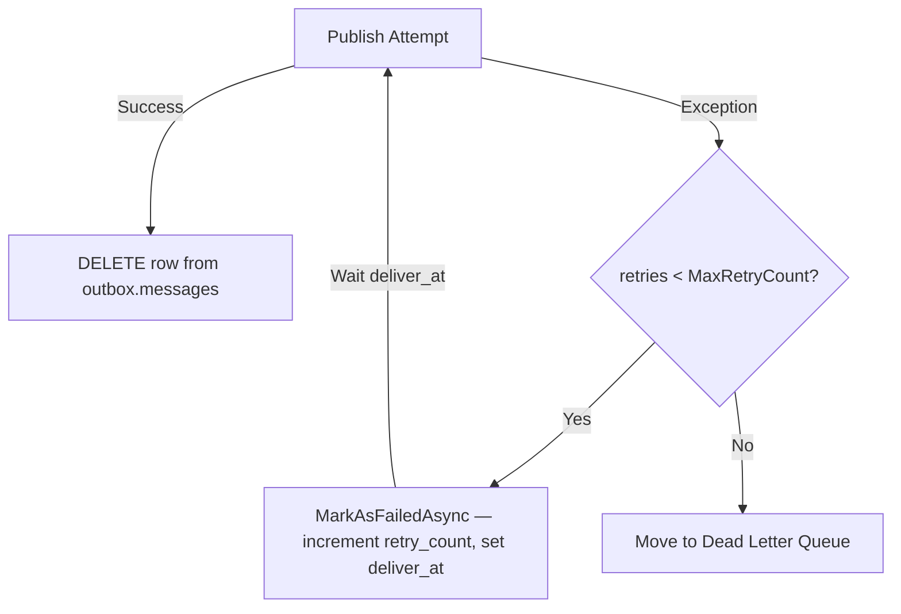
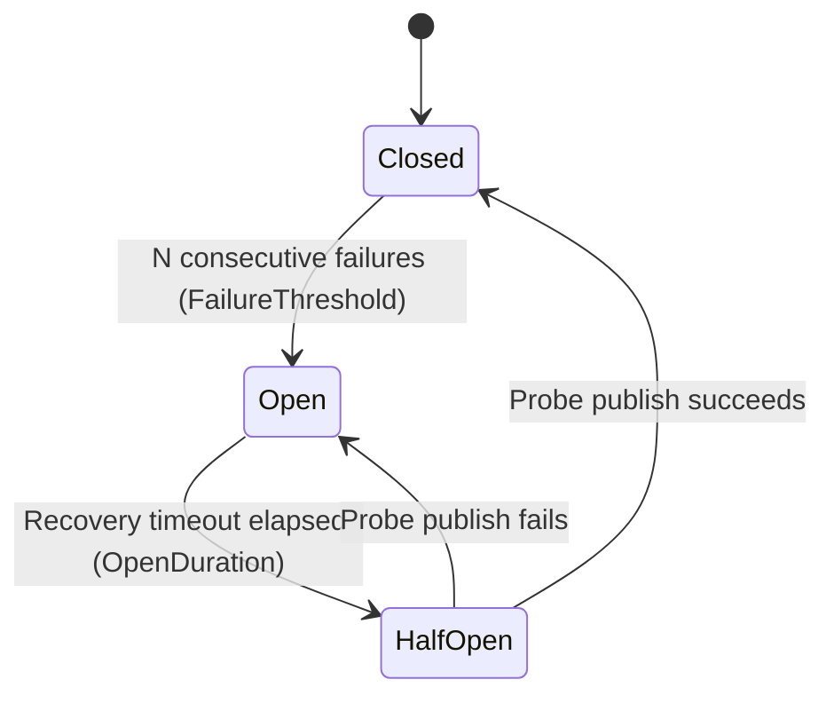

# Level 6: Error Handling and Dead Letter Queue

This level covers the resilience mechanisms built into the dispatcher: retry policies, circuit breaker, Dead Letter Queue (DLQ), exceptions, and error sanitization.

## 1. Retry Policies

The library has **two** distinct retry policy hierarchies:

- **`RetryPolicy` (abstract record hierarchy)** — Configures per-message retry delays, applied by the dispatcher between attempts. Used via `OutboxDispatcherOptions`.
- **`IRetryPolicy` (interface)** — A lower-level interface for programmatic retry control (implements `ShouldRetry` + `GetNextDelay`). Used by custom broker adapters or integration tests.

---

### 1a. `RetryPolicy` Abstract Record Hierarchy (Broker-Level)

The retry policy controls how long the dispatcher waits between broker publish attempts before marking a message as failed. Retry policies are attached to a broker publisher via `UseBroker()` — they are **not** a method on `OutboxOptions` itself.

```csharp
using EricksonLopez.Outbox;
using EricksonLopez.Outbox.Retry;

// --- Option 1: Built-in default (ExponentialBackoff: 1s → 2s → 4s … capped at 30s, 5 attempts) ---
builder.Services.AddOutbox(options =>
{
    options.UseBroker(
        factory: sp => new MyBrokerPublisher(sp.GetRequiredService<IConnection>()),
        retryPolicy: RetryPolicy.Default); // RetryPolicy.Default is ExponentialBackoffRetryPolicy
});

// --- Option 2: Fixed delay retry ---
builder.Services.AddOutbox(options =>
{
    options.UseBroker(
        factory: sp => new MyBrokerPublisher(),
        retryPolicy: new FixedDelayRetryPolicy(
            Delay: TimeSpan.FromSeconds(5),
            MaxAttempts: 5));
});

// --- Option 3: Exponential backoff with cap ---
builder.Services.AddOutbox(options =>
{
    options.UseBroker(
        factory: sp => new MyBrokerPublisher(),
        retryPolicy: new ExponentialBackoffRetryPolicy(
            InitialDelay: TimeSpan.FromSeconds(1),
            MaxAttempts: 10,
            Factor: 2.0,
            MaxDelay: TimeSpan.FromSeconds(30)));
});

// --- Option 4: Exponential backoff with jitter (recommended for multi-instance) ---
builder.Services.AddOutbox(options =>
{
    options.UseBroker(
        factory: sp => new MyBrokerPublisher(),
        retryPolicy: new JitterRetryPolicy(
            InitialDelay: TimeSpan.FromMilliseconds(500),
            MaxAttempts: 10,
            Factor: 2.0,
            MaxDelay: TimeSpan.FromSeconds(60),
            JitterFactor: 0.25)); // ±25% random deviation to prevent thundering herd
});

// --- Option 5: Retry + Circuit Breaker together ---
builder.Services.AddOutbox(options =>
{
    var circuitBreaker = new CircuitBreakerState(
        failureThreshold: 5,
        openDuration: TimeSpan.FromSeconds(30));

    options.UseBroker(
        factory: sp => new MyBrokerPublisher(),
        retryPolicy: RetryPolicy.Default,
        circuitBreaker: circuitBreaker);
});
```

> [!IMPORTANT]
> `OutboxOptions` does **not** have a `UseRetryPolicy()` method. The retry policy is always passed as an optional parameter to `UseBroker()`. The dispatcher's `MaxRetryCount` (in `OutboxDispatcherOptions`) controls how many times a message can fail across polling cycles before it is dead-lettered — these are two orthogonal settings.

### Built-in `RetryPolicy` Implementations

| Class | Kind | Behavior |
|---|---|---|
| `RetryPolicy.Default` | Static property | Exponential backoff: `1s → 2s → 4s → … capped at 30s`, max 5 attempts. |
| `FixedDelayRetryPolicy` | Sealed record | Constant delay (`Delay`) for every retry. Stops after `MaxAttempts`. |
| `ExponentialBackoffRetryPolicy` | Sealed record | Delay = `InitialDelay × Factor^attempt`. Optionally capped by `MaxDelay`. |
| `JitterRetryPolicy` | Sealed record | Exponential backoff + random jitter of `±JitterFactor × baseDelay`. Prevents thundering herd. |

### `RetryPolicy.GetNextDelay(int currentAttempt)` Contract

`RetryPolicy` is an abstract record. Implement your own by overriding `GetNextDelay`:

```csharp
// Returns the delay before the next attempt, or null to stop retrying.
public sealed record CustomRetryPolicy(int MaxAttempts) : RetryPolicy
{
    public override TimeSpan? GetNextDelay(int currentAttempt)
    {
        if (currentAttempt >= MaxAttempts) return null; // Stop
        return TimeSpan.FromSeconds(currentAttempt * 10); // Linear backoff: 10s, 20s, 30s ...
    }
}

// Register via UseBroker:
builder.Services.AddOutbox(options =>
{
    options.UseBroker(
        factory: sp => new MyBrokerPublisher(),
        retryPolicy: new CustomRetryPolicy(MaxAttempts: 7));
});
```

---

### 1b. `IRetryPolicy` Interface (Broker-Adapter Level)

`IRetryPolicy` is a lower-level contract used by broker adapters that need to implement their own retry logic internally (e.g., retrying a connection failure within a single `PublishRawAsync` call):

```csharp
using EricksonLopez.Outbox.Retry;

public class ExponentialBackoffPolicy : IRetryPolicy
{
    private readonly int _maxAttempts;
    private readonly TimeSpan _initialDelay;

    public ExponentialBackoffPolicy(int maxAttempts = 10, int initialDelayMs = 100)
    {
        _maxAttempts = maxAttempts;
        _initialDelay = TimeSpan.FromMilliseconds(initialDelayMs);
    }

    public TimeSpan GetNextDelay(int currentAttempt)
        => TimeSpan.FromMilliseconds(_initialDelay.TotalMilliseconds * Math.Pow(2, currentAttempt - 1));

    public bool ShouldRetry(int currentAttempt, Exception exception)
        => currentAttempt < _maxAttempts;
}
```

### Retry Flow



---

## 2. Circuit Breaker (`CircuitBreakerState`)

If the broker is completely unavailable, the circuit breaker prevents the dispatcher from saturating the database with futile publish attempts.



| State | Behavior |
|---|---|
| **Closed** | Normal operation — all messages are dispatched. |
| **Open** | Circuit is tripped — dispatcher pauses entirely. No database queries. |
| **Half-Open** | A single probe message is attempted. If successful, circuit closes. |

### `CircuitBreakerState` API

```csharp
using EricksonLopez.Outbox;
using EricksonLopez.Outbox.Retry;

// Manually create a circuit breaker (usually used inside custom broker publishers):
var circuitBreaker = new CircuitBreakerState(
    failureThreshold: 5,                       // Open after 5 consecutive failures
    openDuration: TimeSpan.FromSeconds(30));   // Stay open for 30 seconds

// In your broker publisher:
if (!circuitBreaker.AllowRequest())
{
    // Circuit is Open — reject immediately without hitting the broker
    return DispatchResult.FailAndRetry(new CircuitBreakerOpenException("Circuit breaker is Open — broker is unavailable."));
}

try
{
    await SendToRabbitMqAsync(message, ct);
    circuitBreaker.RecordSuccess();            // Reset counter, transition to Closed
    return DispatchResult.Ok();                // ✅ Correct: DispatchResult.Ok() — not .Success()
}
catch (BrokerTransientException ex)           // Transient: network timeout, rate limit
{
    circuitBreaker.RecordFailure();            // Increment failure counter
    return DispatchResult.FailAndRetry(ex);   // ✅ Correct: DispatchResult.FailAndRetry(ex)
}
catch (BrokerFatalException ex)               // Fatal: schema mismatch, auth denied
{
    circuitBreaker.RecordFailure();
    return DispatchResult.FailFatal(ex);       // ✅ Correct: DispatchResult.FailFatal(ex) — no retry, go to DLQ
}
```

> [!WARNING]
> **Do NOT use** `DispatchResult.Success()` or `DispatchResult.Failure()` — these methods do not exist. The correct factory methods are:
> - `DispatchResult.Ok()` — successful dispatch
> - `DispatchResult.FailAndRetry(Exception)` — transient failure, dispatcher will retry
> - `DispatchResult.FailFatal(Exception)` — fatal failure, message goes to DLQ immediately
> - `DispatchResult.FailFatal(string reason)` — fatal failure with string reason
> - `DispatchResult.FailFatal(Guid messageId, int retryCount, string reason)` — fatal with full context

### `CircuitBreakerState` API Reference

| Member | Description |
|---|---|
| `CircuitBreakerState(int failureThreshold, TimeSpan? openDuration)` | Constructor. `failureThreshold` must be > 0. `openDuration` defaults to 30s. |
| `CircuitState State { get; }` | Current state. Automatically transitions Open → HalfOpen when `OpenDuration` elapses. |
| `int FailureThreshold { get; }` | Number of consecutive failures to open the circuit. |
| `TimeSpan OpenDuration { get; }` | Duration the circuit remains Open before probing. |
| `bool AllowRequest()` | Returns `true` if `State != Open`. |
| `void RecordSuccess()` | Resets `_failureCount = 0` and transitions to `Closed`. |
| `void RecordFailure()` | Increments `_failureCount`; opens immediately if in HalfOpen or threshold reached. |

---

## 3. Dead Letter Queue (DLQ)

Messages that exhaust all retry attempts are moved to the `outbox.dead_letters` table via `IDeadLetterRepository`:

### DLQ Table Schema

| Column | Type | Description |
|---|---|---|
| `id` | `uuid` / `uniqueidentifier` | Copy of the original message ID. |
| `original_message_id` | `uuid` | Original outbox message ID (same as `id`). |
| `message_type` | `varchar(255)` | Message type alias (e.g., `"order-created-v1"`). |
| `payload` | `text` / `jsonb` | Serialized message body. |
| `correlation_id` | `varchar(255)` | W3C correlation ID (nullable). |
| `causation_id` | `varchar(255)` | Causation ID (nullable). |
| `headers_json` | `text` | Custom headers as JSON (default: `{}`). |
| `created_at` | `timestamptz` | When the message was originally stored. |
| `dead_lettered_at` | `timestamptz` | When the message was moved to DLQ. |
| `retry_count` | `int` | Total retry attempts made. |
| `reason` | `varchar(500)` | Short reason string (e.g., `"Unknown message type: foo"`). |
| `last_error` | `text` | Last exception message (sanitized by `IErrorSanitizer`). |

### Manual Replay

Dead-lettered messages can be replayed by moving them back to the outbox:

```sql
-- Replay a specific message by moving it back to the outbox table:
INSERT INTO outbox.messages (id, type, payload, correlation_id, causation_id, headers_json, created_at, state, retry_count)
SELECT 
    original_message_id,
    message_type,
    payload,
    correlation_id,
    causation_id,
    headers_json,
    NOW(),
    0,     -- Pending
    0
FROM outbox.dead_letters
WHERE id = '<message-id>';

DELETE FROM outbox.dead_letters WHERE id = '<message-id>';
```

> [!WARNING]
> **DLQ Insert Failure Behavior:** If the DLQ INSERT itself fails, the outbox
> message is promoted to state `4` (DeadLettered) regardless, to prevent an
> infinite retry loop. An `Error`-level log (`DlqInsertFailed`) is emitted with
> the message ID for manual recovery.

---

## 4. Error Sanitization (`IErrorSanitizer`)

The `IErrorSanitizer` interface controls how exception messages are persisted to the `last_error` column. The default implementation (`DefaultErrorSanitizer`) truncates to 4,000 characters.

### Custom Sanitizer Example

```csharp
using EricksonLopez.Outbox.Diagnostics;

public sealed class CustomErrorSanitizer : IErrorSanitizer
{
    public string Sanitize(Exception exception)
    {
        // Redact connection strings that may appear in SQL exception messages
        if (exception.Message.Contains("Password=", StringComparison.OrdinalIgnoreCase) ||
            exception.Message.Contains("pwd=", StringComparison.OrdinalIgnoreCase))
        {
            return $"[REDACTED — {exception.GetType().Name}] A database error occurred.";
        }

        // Truncate at 4000 characters to match the column limit
        var message = exception.ToString();
        return message.Length > 4000 ? message[..4000] : message;
    }
}
```

Register it as a singleton:

```csharp
services.AddSingleton<IErrorSanitizer, CustomErrorSanitizer>();
```

> [!CAUTION]
> If your broker publisher or middleware throws exceptions containing sensitive
> data (e.g., connection strings in stack traces), that data will be stored in
> the database. Always implement a custom `IErrorSanitizer` in production.

---

## 5. Outbox Exception Types

The library provides a typed exception hierarchy for programmatic error handling:

```csharp
using EricksonLopez.Outbox;

// Base class — catch all outbox exceptions:
catch (OutboxException ex) { ... }

// Specific types:
catch (OutboxTypeNotRegisteredException ex)
{
    // A StoreAsync() call was made for a type not registered in IOutboxMessageTypeResolver.
    // ex.MessageType contains the unregistered CLR type.
    logger.LogError("Unregistered type: {Type}", ex.MessageType.FullName);
}

catch (OutboxSerializationException ex)
{
    // IOutboxSerializer.Serialize<T>() threw an exception.
    // ex.MessageTypeAlias contains the alias of the failed type.
    logger.LogError("Serialization failed for: {Alias}", ex.MessageTypeAlias);
}

catch (OutboxConfigurationException ex)
{
    // OutboxStartupValidator detected a misconfigured required service.
    // Always thrown at startup — cannot occur at runtime.
    logger.LogCritical("Outbox misconfigured: {Message}", ex.Message);
}

catch (OutboxPayloadTooLargeException ex)
{
    // Serialized payload exceeds MaxPayloadSizeInBytes (default: 1 MB).
    // ex.ActualSize and ex.MaxAllowedSize are available.
    logger.LogWarning(
        "Payload too large: {ActualSize} bytes (max {MaxAllowedSize})",
        ex.ActualSize, ex.MaxAllowedSize);

    // Custom large-message handling: offload to blob storage, store reference:
    var blobRef = await _blobStorage.UploadAsync(largePayload, ct);
    await _outbox.StoreAsync(new LargePayloadReference(blobRef), txContext, ct);
}

catch (OutboxHeadersTooLargeException ex)
{
    // Serialized headers exceed MaxHeaderSizeInBytes (default: 64 KB).
    logger.LogWarning(
        "Headers too large: {ActualSize} bytes (max {MaxAllowedSize})",
        ex.ActualSize, ex.MaxAllowedSize);
}

catch (OutboxDispatchException ex)
{
    // A message exhausted all retry attempts. ex.MessageId and ex.AttemptCount are available.
    // This is typically logged by the dispatcher — you rarely need to catch this directly.
    logger.LogError(
        "Message {MessageId} failed after {Attempts} attempts",
        ex.MessageId, ex.AttemptCount);
}

catch (OutboxRuntimeException ex)
{
    // An unexpected error during polling, dispatching, or reclaim operations.
    logger.LogError(ex, "Unexpected outbox runtime error");
}
```

### Exception Hierarchy

```
OutboxException (base)
├── OutboxTypeNotRegisteredException
├── OutboxSerializationException
├── OutboxConfigurationException
├── OutboxRuntimeException
├── OutboxDispatchException
├── OutboxPayloadTooLargeException
└── OutboxHeadersTooLargeException
```

---

**Next:** In [Level 7](level-07-scalability.md), you will learn about horizontal scaling and multi-instance deployment.
