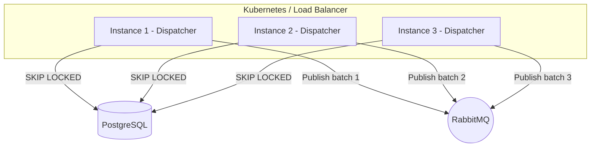

# Level 7: Scalability and Multi-Instance Deployment

This level covers horizontal scaling patterns, database locking strategies, and production deployment considerations.

## 1. Horizontal Scaling

`EricksonLopez.Outbox` supports running **multiple dispatcher instances** concurrently without external coordination. This is achieved through database-native row locking.



### How It Works

1. Each dispatcher instance issues a `SELECT ... FOR UPDATE SKIP LOCKED` query.
2. The database **atomically locks** a batch of rows and returns them to the requesting instance.
3. Other instances skip those locked rows and fetch their own non-overlapping batch.
4. No message is processed by more than one instance simultaneously.

### Concurrency Strategies by Database

| Database | Lock Statement | Multi-Instance Safe? |
|---|---|---|
| PostgreSQL | `FOR UPDATE SKIP LOCKED` | ✅ Yes |
| SQL Server | `WITH (UPDLOCK, READPAST)` | ✅ Yes |
| MySQL 8.0+ | `FOR UPDATE SKIP LOCKED` | ✅ Yes |
| Oracle 12c+ | `FOR UPDATE SKIP LOCKED` | ✅ Yes |
| SQLite | WAL-mode table lock | ❌ Single instance only |

## 2. Producer-Only vs. Full-Stack Deployment

You can separate the **producer** (API that stores events) from the **dispatcher** (background worker that publishes events):

### Producer API (stores events only)

```csharp
// Program.cs — API project
builder.Services.AddOutbox(options => { /* ... */ });
// NOTE: No AddOutboxDispatcher() — this instance only writes messages
```

### Dispatcher Worker (processes events only)

```csharp
// Program.cs — Worker project
builder.Services.AddOutbox(options => { /* ... */ });
builder.Services.AddOutboxDispatcher(options =>
{
    options.BatchSize = 200;
    options.MaxDegreeOfParallelism = 8;
    options.UseAdaptivePolling = true;
});
```

This pattern is useful when:
- Your API needs to remain lightweight and fast
- You want to scale dispatchers independently from APIs
- You need dedicated infrastructure for high-throughput message publishing

## 3. Observability

### OpenTelemetry Integration

`EricksonLopez.Outbox` emits tracing via `OutboxActivitySource`. Use the `SourceName` constant to subscribe:

```csharp
using EricksonLopez.Outbox.Diagnostics;

builder.Services.AddOpenTelemetry()
    .WithTracing(tracing => tracing
        .AddSource(OutboxActivitySource.SourceName) // = "EricksonLopez.Outbox"
        .AddNpgsql()
        .AddOtlpExporter())
    .WithMetrics(metrics => metrics
        .AddMeter(OutboxActivitySource.SourceName) // same name as the ActivitySource
        .AddOtlpExporter());
```

### Reducing Dispatch Latency with `IPollerWakeup`

After storing a message, wake up the dispatcher immediately to skip the next polling interval:

```csharp
using EricksonLopez.Outbox.Dispatcher;

// IPollerWakeup is registered automatically by AddOutboxDispatcher()
await pollerWakeup.WakeAsync(ct); // Signal — does not block
```

See [Level 5 — Processing](level-05-processing.md#2-adaptive-polling-adaptivepoller) for a complete example.

### Metrics (`OutboxMetrics`)

The library emits `System.Diagnostics.Metrics` instruments:

| Meter | Instrument | Kind | Description |
|---|---|---|---|
| `EricksonLopez.Outbox` | `outbox.messages.stored` | Counter | Messages stored via `StoreAsync()`. |
| `EricksonLopez.Outbox` | `outbox.messages.dispatched` | Counter | Messages successfully published. |
| `EricksonLopez.Outbox` | `outbox.messages.failed` | Counter | Messages that failed dispatch. |
| `EricksonLopez.Outbox` | `outbox.messages.dead_lettered` | Counter | Messages moved to DLQ. |
| `EricksonLopez.Outbox` | `outbox.messages.pending` | ObservableGauge | Current pending message count (polled every `PendingCountRefreshInterval`). |

### Grafana Dashboard

A pre-built Grafana dashboard is available at `grafana/dashboards/outbox-dashboard.json`. Import it into your Grafana instance to visualize outbox throughput, failure rates, and DLQ accumulation.

## 4. Health Checks

```csharp
builder.Services.AddHealthChecks()
    .AddOutbox(warningThreshold: 500);
```

| Health Status | Condition |
|---|---|
| `Healthy` | Dispatcher running, pending messages below threshold |
| `Degraded` | Pending messages exceed `warningThreshold` |
| `Unhealthy` | Dispatcher not running or database unreachable |

---

**Next:** In [Level 8](level-08-customization.md), you will learn how to extend the outbox with custom middleware, serializers, and brokers.
