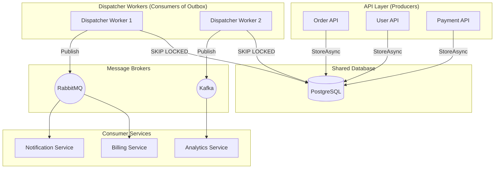

# Level 10: Enterprise Architecture

This level covers production-grade deployment patterns, testing strategies, and security considerations for `EricksonLopez.Outbox` in enterprise environments.

## 1. Reference Architecture



---

## 2. Testing Strategies

### Unit Testing with `InMemoryOutboxStore` and `TestingOutboxExtensions`

The library ships a full testing toolkit in the `EricksonLopez.Outbox.Testing` namespace.

#### Core Testing Types

| Type | Description |
|---|---|
| `InMemoryOutboxStore` | In-memory `IOutbox` implementation that captures stored messages for assertions. |
| `OutboxTesterImpl` | Wraps `InMemoryOutboxStore` and implements `IOutboxTester` for fluent assertions. |
| `FakeBrokerPublisher` | Records all publish calls; returns configurable `DispatchResult`. |
| `FakeOutboxRepository` | In-memory `IOutboxRepository` that simulates fetch/mark operations. |
| `FakeDeadLetterRepository` | In-memory `IDeadLetterRepository` for DLQ testing. |
| `FakeIdempotencyRepository` | In-memory `IIdempotencyRepository` for idempotency testing. |
| `FakeInboxIdempotencyChecker` | Configurable `IInboxIdempotencyChecker` (returns `true` or `false` on demand). |
| `FakeOutboxDispatcher` | Manually-triggered dispatcher for integration tests. |

#### `InMemoryOutboxStore` — Basic Assertions

The `InMemoryOutboxStore` implements `IOutbox` and captures every `StoreAsync()` call. The `TestingOutboxExtensions` class adds fluent assertion methods:

```csharp
using EricksonLopez.Outbox.Testing;
using Xunit;

[Fact]
public async Task PlaceOrder_StoresOrderCreatedEvent()
{
    // Arrange
    var store = new InMemoryOutboxStore();
    var service = new OrderService(_dbContext, store);

    // Act
    await service.PlaceOrderAsync(new CreateOrderCommand("customer-1", 99.99m), default);

    // Assert — using InMemoryOutboxStore direct extensions:

    // At least one message of type was stored:
    store.ShouldHavePublished<OrderCreatedEvent>();

    // Exactly one message was stored:
    var evt = store.ShouldHavePublishedOnce<OrderCreatedEvent>();
    Assert.Equal("customer-1", evt.CustomerId);
    Assert.Equal(99.99m, evt.Total);

    // Filtered assertion — must match predicate:
    store.ShouldHavePublished<OrderCreatedEvent>(e => e.CustomerId == "customer-1");

    // Assert exact count:
    store.ShouldHavePublishedTimes<OrderCreatedEvent>(count: 1);

    // Assert not published:
    store.ShouldNotHavePublished<OrderCancelledEvent>();

    // Total messages across all types:
    Assert.Equal(1, store.TotalPublishedCount());
}
```

#### `OutboxTesterImpl` — Fluent Assertion Builder

`OutboxTesterImpl` provides the `IOutboxTester` fluent API via `ShouldHavePublished<T>()`:

```csharp
using EricksonLopez.Outbox.Testing;
using Xunit;

[Fact]
public async Task PlaceOrder_StoresCorrectEvent()
{
    // Arrange
    var store = new InMemoryOutboxStore();
    var tester = new OutboxTesterImpl(store);
    var service = new OrderService(_dbContext, store);

    // Act
    await service.PlaceOrderAsync(new CreateOrderCommand("customer-1", 99.99m), default);

    // Assert — using IOutboxTester fluent API:

    // Chain: ShouldHavePublished<T>() returns IOutboxAssertion<T>
    tester.ShouldHavePublished<OrderCreatedEvent>()
          .WithCondition(e => e.CustomerId == "customer-1")  // Filter by predicate
          .Once();                                           // Assert exactly one match

    tester.ShouldHavePublished<OrderCreatedEvent>()
          .Times(1);                                         // Assert exact count

    tester.ShouldHavePublished<OrderCreatedEvent>()
          .AtLeastOnce();                                    // Assert at least one match
}
```

#### `TestingOutboxExtensions` — Shorthand on `IOutboxTester`

```csharp
using EricksonLopez.Outbox.Testing;

// Direct shorthand extensions on IOutboxTester:
tester.ShouldHavePublishedOnce<OrderCreatedEvent>();

tester.ShouldHavePublishedOnce<OrderCreatedEvent>(e => e.CustomerId == "customer-1");

tester.ShouldHavePublished<OrderCreatedEvent>(e => e.CustomerId == "customer-1");

tester.ShouldNotHavePublished<OrderCancelledEvent>();

tester.ShouldHavePublishedTimes<OrderCreatedEvent>(times: 2);
```

#### `IOutboxAssertion<T>` API Reference

| Method | Description |
|---|---|
| `WithCondition(Func<TMessage, bool>)` | Filters to matching payloads only. Chainable. |
| `Once()` | Asserts exactly 1 matching message. Throws `InvalidOperationException` if count ≠ 1. |
| `Times(int count)` | Asserts exactly `count` matching messages. |
| `AtLeastOnce()` | Asserts at least 1 matching message. |
| `Never()` | Asserts 0 matching messages. |

#### `InMemoryOutboxStore` API Reference

| Method | Description |
|---|---|
| `GetPublishedMessages<TMessage>()` | Returns all stored messages of the given type. |
| `Clear()` | Clears all stored messages (useful in `beforeEach` test hooks). |
| `TotalPublishedCount()` (extension) | Total messages stored across all types. |
| `ShouldHavePublished<T>()` (extension) | Asserts at least one message of type T was stored. |
| `ShouldHavePublished<T>(predicate)` (extension) | Asserts at least one matching message was stored. |
| `ShouldHavePublishedOnce<T>()` (extension) | Asserts exactly one message of type T. Returns it. |
| `ShouldHavePublishedOnce<T>(predicate)` (extension) | Asserts exactly one matching message. Returns it. |
| `ShouldHavePublishedTimes<T>(count)` (extension) | Asserts exactly `count` messages of type T. |
| `ShouldNotHavePublished<T>()` (extension) | Asserts no messages of type T were stored. |
| `ShouldNotHavePublished<T>(predicate)` (extension) | Asserts no matching messages were stored. |

### Integration Testing with Testcontainers

The repository uses **Testcontainers** for integration tests — spinning up real PostgreSQL instances:

```csharp
using Testcontainers.PostgreSql;
using Testcontainers.RabbitMq;
using Xunit;

public class OutboxIntegrationTests : IAsyncLifetime
{
    private readonly PostgreSqlContainer _postgres = new PostgreSqlBuilder()
        .WithImage("postgres:16-alpine")
        .Build();

    private readonly RabbitMqContainer _rabbit = new RabbitMqBuilder()
        .WithImage("rabbitmq:3-management-alpine")
        .Build();

    public async Task InitializeAsync()
    {
        await _postgres.StartAsync();
        await _rabbit.StartAsync();
    }

    [Fact]
    public async Task EndToEnd_MessageIsPublished()
    {
        // Build a real host with the real PostgreSQL connection
        var host = Host.CreateDefaultBuilder()
            .ConfigureServices((ctx, services) =>
            {
                services.AddSingleton(_ => NpgsqlDataSource.Create(_postgres.GetConnectionString()));
                services.AddScoped<IOutboxRepository, PostgreSqlOutboxRepository>();
                services.AddScoped<IDeadLetterRepository, PostgreSqlDeadLetterRepository>();
                services.AddSingleton<IBrokerPublisher>(new FakeBrokerPublisher());
                services.AddOutbox(opt =>
                {
                    opt.UseSerializer(new NativeAotJsonSerializer(TestJsonContext.Default));
                    opt.UseGeneratedTypes();
                });
                services.AddOutboxDispatcher();
            })
            .Build();

        await host.StartAsync();

        // Verify full end-to-end dispatch
        var fakeBroker = host.Services.GetRequiredService<IBrokerPublisher>() as FakeBrokerPublisher;
        // ... assertions on fakeBroker.PublishedMessages
    }

    public async Task DisposeAsync()
    {
        await _postgres.DisposeAsync();
        await _rabbit.DisposeAsync();
    }
}
```

### Mutation Testing

[Stryker.NET](https://stryker-mutator.io/docs/stryker-net/introduction/) validates that the test suite actually asserts correct behavior:

```bash
dotnet stryker -f stryker-config.json
```

Thresholds: **100%** target, **98%** warning, **95%** build break.

---

## 3. Security in Production

### Strong Name Signing

All assemblies are signed with `EricksonLopez.snk` to prevent assembly spoofing. The key is stored as a CI secret (`SNK_KEY`) and decoded at build time.

### Supply Chain Integrity

| Protection | Mechanism |
|---|---|
| **OIDC Publishing** | `NuGet/login@v1` — no static API keys in the repository |
| **Sigstore Attestation** | `actions/attest-build-provenance@v2` on all `.nupkg` files |
| **NuGet Audit** | `NuGetAuditMode=all`, `NuGetAuditLevel=low` — any CVE blocks the build |
| **Dependabot** | Weekly NuGet + monthly GitHub Actions updates |

### Data Security Considerations

| Risk | Mitigation |
|---|---|
| Sensitive data in `last_error` column | Implement `IErrorSanitizer` to redact connection strings, tokens |
| Payload exposure in DLQ | Encrypt message payloads at the serializer level |
| SQL injection via payloads | The library uses parameterized queries exclusively — payloads are stored as binary/JSON, never interpolated into SQL |

---

## 4. Production Checklist

- [ ] **Database**: Use PostgreSQL or SQL Server for production (not SQLite)
- [ ] **Dispatcher**: Run at least 2 dispatcher instances for high availability
- [ ] **Monitoring**: Configure OpenTelemetry metrics export to your observability stack
- [ ] **Health Checks**: Register `.AddOutbox()` health check with appropriate threshold
- [ ] **DLQ Review**: Set up alerting on the `outbox.dead_letters` table
- [ ] **Backup**: Include `outbox.messages` and `outbox.dead_letters` tables in backup strategy
- [ ] **Connection Pooling**: Use `NpgsqlDataSource` or connection pooling for raw ADO.NET providers
- [ ] **Inbox Cleanup**: Configure `AddOutboxInbox()` with appropriate `RetentionPeriod`
- [ ] **Error Sanitizer**: Register a custom `IErrorSanitizer` to avoid leaking sensitive data into the DB
- [ ] **Circuit Breaker**: Configure `CircuitBreakerState` in broker publishers for broker resilience

---

## 5. Performance Tuning

| Parameter | Low Volume (<100 msg/s) | Medium (100-1K msg/s) | High (>1K msg/s) |
|---|---|---|---|
| `BatchSize` | 20 | 100 | 500 |
| `PollingInterval` | 2s | 500ms | 100ms |
| `MaxDegreeOfParallelism` | 1 | 4 | 8–16 |
| `UseAdaptivePolling` | `true` | `true` | `false` (fixed interval) |
| Dispatcher Instances | 1 | 2 | 4+ |
| `HasOnlySingletonMiddlewares` | `true` | `true` | `true` |

---

**Next:** In [Level 11](level-11-administration.md), you will learn about Administration, Monitoring, and Dead Letter Queue management.

### Related

- [Architecture](../architecture.md) — system-level design
- [API Reference](../api-reference.md) — public API surface with accurate signatures
- [Testing Guide](level-12-testing.md) — complete testing reference
- [Compatibility Matrix](../compatibility-matrix.md) — supported platforms
