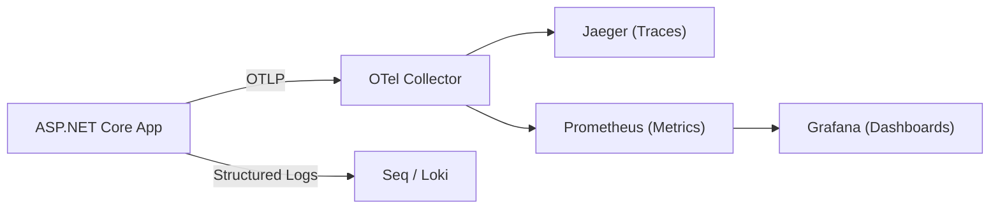

<!-- Copyright © Erickson Lopez. MIT License. -->

# Level 13: Diagnostics and Observability

This level covers the built-in observability layer of `EricksonLopez.Outbox`: OpenTelemetry traces, metrics, and error sanitization.

## 1. OpenTelemetry Integration

The library ships with first-class OpenTelemetry support via `OutboxActivitySource` and `OutboxMetrics`. These are automatically active when you call `AddOutbox()` — no additional configuration is required to emit telemetry.

### Tracing (`OutboxActivitySource`)

The outbox creates `Activity` spans for its two main operations:

| Activity Name | When | Key Tags |
|---|---|---|
| `outbox.store` | Every `IOutbox.StoreAsync()` call | `messaging.message.type`, `messaging.outbox.batch_size` |
| `outbox.dispatch` | Every broker publish attempt | `messaging.system`, `messaging.message.type`, `messaging.message.id`, `messaging.destination` |

```csharp
using OpenTelemetry.Trace;

// Add Outbox tracing to your OTEL TracerProvider:
builder.Services.AddOpenTelemetry()
    .WithTracing(tracing => tracing
        .AddAspNetCoreInstrumentation()
        .AddNpgsql()
        .AddSource(OutboxActivitySource.SourceName) // "EricksonLopez.Outbox"
        .AddOtlpExporter());
```

> [!NOTE]
> The activity source name is `"EricksonLopez.Outbox"`. Use `OutboxActivitySource.SourceName` to avoid hardcoding this string.

### Metrics (`OutboxMetrics`)

The library emits the following metrics via `System.Diagnostics.Metrics`:

| Metric Name | Instrument | Description |
|---|---|---|
| `outbox.messages.stored` | Counter | Number of messages stored via `StoreAsync`. |
| `outbox.messages.dispatched` | Counter | Number of messages successfully dispatched to the broker. |
| `outbox.messages.failed` | Counter | Number of dispatch failures (increments on each failure). |
| `outbox.messages.dead_lettered` | Counter | Number of messages moved to the Dead Letter Queue. |
| `outbox.messages.pending` | ObservableGauge | Current count of pending messages (polled every `PendingCountRefreshInterval`). |
| `outbox.dispatch.duration` | Histogram | Broker publish duration in milliseconds. |

```csharp
using OpenTelemetry.Metrics;

// Add Outbox metrics to your OTEL MeterProvider:
builder.Services.AddOpenTelemetry()
    .WithMetrics(metrics => metrics
        .AddAspNetCoreInstrumentation()
        .AddMeter(OutboxMetrics.MeterName) // "EricksonLopez.Outbox"
        .AddOtlpExporter());
```

> [!TIP]
> **High-cardinality alert:** By default, all metrics include a `messaging.message.type` dimension (tag). In high-throughput systems with many message types, this can cause metric cardinality explosion in your monitoring backend (Prometheus, Datadog, etc.).
>
> Disable it via `RuntimeOptions.IncludeMessageTypeTag = false`:
> ```csharp
> options.ConfigureRuntimeOptions(runtime =>
> {
>     runtime.IncludeMessageTypeTag = false; // Reduces cardinality
> });
> ```

---

## 2. `OutboxActivitySource` — Activity Source Reference

```csharp
using EricksonLopez.Outbox.Diagnostics;

// Source name constant — use in AddSource() calls:
string sourceName = OutboxActivitySource.SourceName; // "EricksonLopez.Outbox"

// OTel system sentinel value used as default messaging.system tag:
string outboxSystem = OutboxActivitySource.OutboxSystemName; // "outbox"
```

### `IBrokerPublisher.BrokerSystemName`

Every broker publisher can override the `messaging.system` OTel tag by implementing the `BrokerSystemName` property. The dispatcher reads this property and sets the tag automatically — no manual `Activity.Current?.SetTag()` calls needed in the publisher:

```csharp
public sealed class KafkaBrokerPublisher : IBrokerPublisher
{
    // Override the default "outbox" tag with the actual broker system name.
    public string BrokerSystemName => "kafka"; // OTel canonical name for Apache Kafka

    public async ValueTask<DispatchResult> PublishRawAsync(
        OutboxMessage message,
        MessageMetadata metadata,
        DispatchContext context)
    {
        // The dispatcher has already set messaging.system = "kafka" before calling this.
        // ...
        return DispatchResult.Ok();
    }
}
```

| Broker | `BrokerSystemName` value |
|---|---|
| RabbitMQ | `"rabbitmq"` |
| Apache Kafka | `"kafka"` |
| Azure Service Bus | `"azure_service_bus"` |
| Amazon SQS | `"aws_sqs"` |
| Google Pub/Sub | `"gcp_pubsub"` |
| NATS | `"nats"` |
| Redis Streams | `"redis"` |
| *(default fallback)* | `"outbox"` |

---

## 3. `IErrorSanitizer` — Scrubbing Exceptions Before Persistence

Before exceptions are written to the `last_error` column of the Dead Letter Queue table, the library calls `IErrorSanitizer.Sanitize(Exception)`. The default implementation (`DefaultErrorSanitizer`) truncates the message at 4,000 characters.

### Why This Matters

Broker exceptions can contain sensitive data in their stack traces:
- PostgreSQL `NpgsqlException` may include the connection string in its message
- HTTP client exceptions may include authorization headers
- Custom broker adapters may log credentials in error messages

### Implementing a Custom Sanitizer

```csharp
using EricksonLopez.Outbox.Diagnostics;

public sealed class CustomErrorSanitizer : IErrorSanitizer
{
    private static readonly string[] SensitivePatterns =
    [
        "Password=", "pwd=", "ApiKey=", "Bearer ", "Authorization:"
    ];

    public string Sanitize(Exception exception)
    {
        var message = exception.ToString();

        // Redact any message containing sensitive data
        foreach (var pattern in SensitivePatterns)
        {
            if (message.Contains(pattern, StringComparison.OrdinalIgnoreCase))
                return $"[REDACTED — {exception.GetType().Name}] A sensitive error occurred. Check application logs.";
        }

        // Truncate at 4000 characters to match the DB column limit
        return message.Length > 4000 ? message[..4000] : message;
    }
}

// Register as Singleton before AddOutbox():
builder.Services.AddSingleton<IErrorSanitizer, CustomErrorSanitizer>();
builder.Services.AddOutbox(...);
```

> [!CAUTION]
> **Register `IErrorSanitizer` BEFORE calling `AddOutbox()`** to ensure the custom sanitizer is resolved by the startup validator. If registered after, the default implementation may be used instead.

### `IErrorSanitizer` API

| Member | Signature | Description |
|---|---|---|
| `Sanitize` | `string Sanitize(Exception exception)` | Returns a sanitized string to persist in the `last_error` column. |

---

## 4. Recommended Observability Stack



### Minimum Production Dashboard Alerts

| Metric | Alert Condition | Severity |
|---|---|---|
| `outbox.messages.pending` | > 1,000 messages for 5 min | Warning |
| `outbox.messages.pending` | > 10,000 messages for 2 min | Critical |
| `outbox.messages.dead_lettered` | > 0 in last 1 min | Warning |
| `outbox.messages.failed` | Rate > 10/min sustained | Warning |
| `outbox.dispatch.duration` | P99 > 5,000ms | Warning |

---

**Previous:** [Level 12 — Testing Guide](level-12-testing.md)
